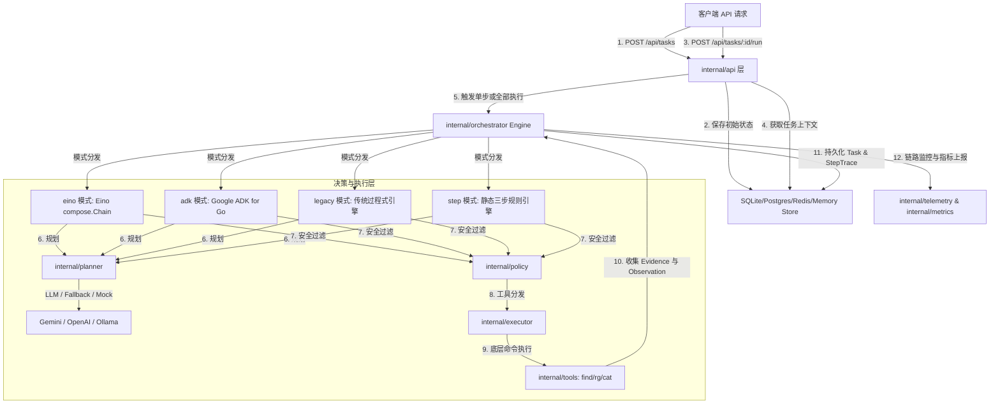
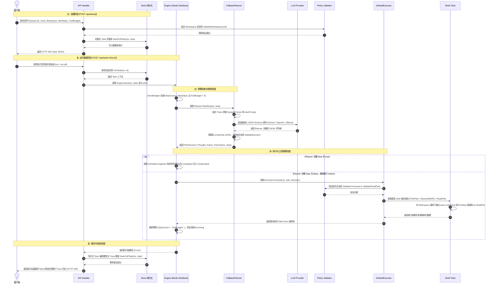

# AI Agent 项目深度总结与任务执行步骤分析

生成日期：2026-05-29
项目路径：[ai-agent (wuxujun/ai-agent)](file:///Users/xujunwu/Documents/IDEAProject/ai-agent)

---

## 1. 项目定位与核心设计

本项目是一个基于 Go 语言构建的 **AI Agent 执行运行时引擎 (Agent Runtime)**。系统围绕用户的“任务目标（Goal）”展开，在受信任的“工作空间（Workspace）”沙箱内执行多轮的“规划-执行-观测（Plan-Execute-Observe）”循环，进行文件的查找、搜索和内容检索。

项目的一大核心特色是实现了**多编排引擎入口设计**，目前支持 Eino Chain 编排、Google ADK 编排、Legacy 编排以及 Step 静态规则编排，所有编排模式均复用统一的 Web API、数据库存储、安全策略和可观测性组件。

### 核心架构图



### 架构可视化


---

## 2. 核心技术栈

| 类别 | 技术组件 | 作用与说明 |
| --- | --- | --- |
| **开发语言** | Go 1.25 | 项目的基础运行环境，在 [go.mod](file:///Users/xujunwu/Documents/IDEAProject/ai-agent/go.mod) 中指定。 |
| **HTTP API 框架** | Gin v1.12.0 | 提供高效的 RESTful API 接口，配置并暴露路由组及中间件。 |
| **Eino 编排** | CloudWeGo Eino v0.9.2 | 字节跳动开源的大模型应用开发框架。使用 `compose.Chain` 将预算检查、规划、执行节点组装为链式有向图。 |
| **ADK 编排** | Google ADK for Go v1.3.0 | 谷歌官方的 Agent 开发套件。利用其 Tool、LLMAgent 与 Runner 实现工具自动回调和多轮对话。 |
| **LLM 客户端** | Google GenAI SDK v1.58.0 | 用于 ADK 和 Gemini 模式下调用 Gemini 2.5 Flash 等模型，支持 Schema 约束。 |
| **数据持久化** | SQLite (modernc.org/sqlite) | 默认存储模式，纯 Go 实现的无 CGO 依赖 SQLite，本地文件位于 `data/agent.db`。 |
| **多后端存储** | PostgreSQL & Redis & Memory | 支持通过环境变量配置分布式或内存存储以满足不同环境部署需求。 |
| **可观测性** | OpenTelemetry (OTel) | 实现了链路追踪（Traces）与指标收集（Metrics），向 `127.0.0.1:4318` 发送 OTLP 报文。 |
| **底层查找与检索** | `find`、`ripgrep (rg)` | 系统本地安装的安全白名单命令，用于高速文件和文本检索。 |

---

## 3. 详细项目目录结构

```text
.
├── cmd/
│   └── server/
│       └── main.go                 # 系统的入口点。加载环境变量、初始化 OTel、装配 Planner 与 Engine、启动 Gin 服务器
├── internal/
│   ├── api/
│   │   ├── handler.go              # 实现创建任务、单步运行、运行全部、获取详情与指标的 HTTP 控制器
│   │   ├── middleware.go           # OTel 链路追踪属性中间件和全局错误处理中间件
│   │   └── router.go               # 路由注册函数空壳（实际在 handler.go 中暴露了 RegisterRoutes）
│   ├── executor/
│   │   └── executor.go             # 实现 DefaultExecutor，将 Planner 的决策（Decision）路由到具体 tools 的执行
│   ├── metrics/
│   │   └── metrics.go              # 本地内存指标与 OTel 监控指标收集器（统计 Planner 耗时、Executor 状态及 Fallback 次数等）
│   ├── orchestrator/
│   │   ├── adk.go                  # Google ADK 编排模式实现，管理 tool 注册、拦截器回调与 Runner 回话
│   │   ├── eino.go                 # CloudWeGo Eino 编排模式实现，定义链式 state 并通过 compose.NewChain 挂载 Lambda
│   │   ├── engine.go               # Engine 核心结构定义、Next 路由与 RunAll 循环执行实现
│   │   ├── state.go                # Task 状态机管理（TransitionTask, SetTaskRunning, SetTaskCompleted 等）
│   │   └── step.go                 # 静态规则编排模式实现，支持固定的三阶段查找/搜索/读取任务
│   ├── planner/
│   │   ├── fallback.go             # 双路容错 Planner：当 primary 报错时自动降级到 secondary，并记录 fallback 指标
│   │   ├── llm.go                  # 多端 LLM 服务调用实现（支持 OpenAI-responses, OpenAI, Gemini, Ollama 协议）
│   │   ├── prompt.go               # 构建 SystemPrompt 与含有 Trace 上下文的 UserPrompt 模板
│   │   ├── schema.go               # 定义 PlanDecision 结构体及大语言模型约束的 JSON Schema 格式
│   │   └── validate.go             # 对 LLM 输出结果的有效性验证（动作类型及参数校验）
│   ├── policy/
│   │   └── policy.go               # 安全控制中心。检验工作空间逃逸、执行命令白名单校验、工作空间防穿透路径校验
│   ├── store/
│   │   ├── store.go                # 数据仓储 Store 接口定义
│   │   ├── sqlite.go               # 基于 SQLite 的任务与步骤 Trace 读写实现，使用 UPSERT 与事务
│   │   ├── postgres.go             # 基于 PostgreSQL 的高并发持久化实现
│   │   ├── redis.go                # 基于 Redis JSON 序列化的缓存级持久化实现
│   │   └── memory.go               # 基于并发安全 Map 的内存临时存储实现
│   ├── telemetry/
│   │   └── telemetry.go            # 初始化 OpenTelemetry SDK 的 Trace Provider 与 Meter Provider，管理优雅停机
│   ├── tools/
│   │   ├── runner.go               # Command 安全运行器，限制超时为 3s 并进行命令校验
│   │   ├── find.go                 # 封装 native find 命令以进行通配符文件检索
│   │   ├── rg.go                   # 封装 native ripgrep 命令以进行高性能全文搜索
│   │   └── read.go                 # 封装文件内容读取，提供 4KB 内容剪切与路径安全检验
│   └── types/
│       └── task.go                 # 定义 Task 实体、StepTrace 步骤轨迹及 Evidence 证据链数据结构
└── workspace/
    └── demo/                       # 预设的演示工作空间，包含 sample.txt 和一系列供检索的 md 文件
```

---

## 4. 任务运行核心生命周期与步骤

当客户端发起一个任务请求后，该任务会经历**创建、装载、预算检查、规划、安全检测与执行、持久化以及状态流转**七大阶段。以下是详细的执行步骤：



### 步骤详情拆解：

#### 第一步：创建任务并检验路径安全
- 客户端通过 `POST /api/tasks` 注册新任务。
- `api.createTask` 处理器提取入参。当 `max_steps` 或 `tool_budget` 未指定时，默认初始化为 `5`。
- 调用 [policy.ValidateWorkspace](file:///Users/xujunwu/Documents/IDEAProject/ai-agent/internal/policy/policy.go#L15)，利用 `filepath.Clean` 过滤防止输入根路径 `/`、当前目录 `.` 或包含 `..` 的非法相对路径。
- 通过 [store.SaveFullTask](file:///Users/xujunwu/Documents/IDEAProject/ai-agent/internal/store/sqlite.go#L123) 将任务信息写入 SQLite/Postgres 中的 `tasks` 表，状态初始设为 `created`。

#### 第二步：触发任务与预算关卡拦截
- 客户端发起运行请求，触发 [Engine.Next](file:///Users/xujunwu/Documents/IDEAProject/ai-agent/internal/orchestrator/engine.go#L40)。
- **预算验证 (budget_guard)**：如果任务的 `StepCount >= MaxSteps` 或 `ToolBudget <= 0`，则表明运行资源已耗尽。此时将终止后续规划与执行，调用 [SetTaskCompleted](file:///Users/xujunwu/Documents/IDEAProject/ai-agent/internal/orchestrator/state.go#L45) 将状态转换为 `completed`，填入最终回复并返回。

#### 第三步：规划器 (Planner) 决策与容错
- 调用 [Planner.PlanNext](file:///Users/xujunwu/Documents/IDEAProject/ai-agent/internal/planner/schema.go#L17) 机制。
- **模板拼接**：[BuildSystemPrompt](file:///Users/xujunwu/Documents/IDEAProject/ai-agent/internal/planner/prompt.go#L10) 强制 LLM 扮演规划师角色并只能输出 JSON Schema 范围内的 Action；[BuildUserPrompt](file:///Users/xujunwu/Documents/IDEAProject/ai-agent/internal/planner/prompt.go#L29) 汇总了任务目标、当前的 Step、最近 4 步的历史 Trace 以及上一步返回的 Evidence 证据内容。
- **多提供商分发**：根据环境变量 `AI_AGENT_LLM_PROVIDER` 将请求路由至不同的 LLM 接口：
  - `openai-responses` / `openai`：通过 HTTP POST 请求带有严格 JSON 模式定义的 Chat API。
  - `gemini`：通过 Google GenAI 官方 SDK，应用 `ResponseMIMEType: "application/json"` 并将 Eino-style Schema 转化为 `genai.Schema` 进行约束生成。
- **降级保护 (Fallback)**：使用双路 Planner 封装（Primary 为 LLM，Secondary 为静态 [MockPlanner](file:///Users/xujunwu/Documents/IDEAProject/ai-agent/internal/planner/mock.go)）。如果网络发生抖动或大模型生成格式损坏，Primary 抛出异常，[FallbackPlanner](file:///Users/xujunwu/Documents/IDEAProject/ai-agent/internal/planner/fallback.go) 将拦截该异常，自动将请求导向 Mock 规划器，同时向 metrics 模块递增 `fallback` 统计数，保证运行时服务不中断。
- **结果反序列化与检验**：LLM 响应文本由 [unmarshalDecision](file:///Users/xujunwu/Documents/IDEAProject/ai-agent/internal/planner/llm.go#L432) 处理（包含 `{}` 字符截取提取，以应对不规则的 Markdown 标记输出）。随后使用 [ValidateDecision](file:///Users/xujunwu/Documents/IDEAProject/ai-agent/internal/planner/validate.go) 检查 Action 的取值是否落在 `{"find_files", "search_text", "read_file", "none"}` 范围内。

#### 第四步：执行器 (Executor) 指令安全审查与工具路由
- 获得 `PlanDecision` 后，如果 `Stop` 为 `true`，引擎调用 [SetTaskCompleted](file:///Users/xujunwu/Documents/IDEAProject/ai-agent/internal/orchestrator/state.go#L45) 提早宣告结束。
- 否则，将决策路由到 [DefaultExecutor.Execute](file:///Users/xujunwu/Documents/IDEAProject/ai-agent/internal/executor/executor.go#L23)，匹配具体动作：
  - **`find_files`**：提取参数 `pattern`，调用 [tools.FindFiles](file:///Users/xujunwu/Documents/IDEAProject/ai-agent/internal/tools/find.go#L5)。
  - **`search_text`**：提取 `query` 和 `glob` 参数，调用 [tools.SearchWithRG](file:///Users/xujunwu/Documents/IDEAProject/ai-agent/internal/tools/rg.go#L9)。
  - **`read_file`**：提取 `path` 参数，调用 [tools.ReadFile](file:///Users/xujunwu/Documents/IDEAProject/ai-agent/internal/tools/read.go#L10)。
- **底线防御 (Policy Validation)**：在工具真正运转前，[tools.ReadFile](file:///Users/xujunwu/Documents/IDEAProject/ai-agent/internal/tools/read.go#L10) 会率先启动 [policy.ValidateReadPath](file:///Users/xujunwu/Documents/IDEAProject/ai-agent/internal/policy/policy.go#L33)。通过将工作空间路径与目标文件绝对路径进行清洗与前缀对比（`strings.HasPrefix(targetAbs, workspaceAbs)`），彻底切断外部链接或 `../` 目录穿透（Directory Traversal）漏洞。
- **Native 命令安全执行**：工具模块通过 [tools.RunCommand](file:///Users/xujunwu/Documents/IDEAProject/ai-agent/internal/tools/runner.go#L14) 调用本地 Shell 命令：
  - 启动 `exec.CommandContext` 并绑定 `3秒超时` Context 以防止底层挂起。
  - 检查依赖是否就绪。若本地未安装 `find` 或 `rg`，将抛出直观的安装引导说明。
  - 获取命令输出并封装。`search_text` 会自动把 ripgrep 输出转化为精简的 [Evidence](file:///Users/xujunwu/Documents/IDEAProject/ai-agent/internal/types/task.go#L3) 数组（包含文件相对路径、命中的文本行以及查询关键字）。

#### 第五步：运行状态持久化与可观测性打标
- 执行成功后，引擎完成一次循环：
  - 任务计步累加：`StepCount++`。
  - 预算递减：`ToolBudget--`。
  - 新的步骤轨迹：[StepTrace](file:///Users/xujunwu/Documents/IDEAProject/ai-agent/internal/types/task.go#L9) 被追加进 `Task.Trace` 数组。
  - 任务状态转变为 `running`。
- **数据库事务存储**：调用 [store.ReplaceTraces](file:///Users/xujunwu/Documents/IDEAProject/ai-agent/internal/store/sqlite.go#L96)。为保证强一致性，它会在一条 SQL 事务内首先执行 `DELETE FROM traces WHERE task_id = ?`，随后批量将所有的 Trace 重新插入 `traces` 表中。
- **可观测性链路埋点**：在上述每一个节点（Engine, Planner, Executor, Store）都会通过 OTel tracer 开启一个 Child Span，并将任务的关键状态如 `agent.task.id`、`agent.task.step_count_after`、`agent.task.tool_budget_after` 以及执行的动作名称作为 Span 标签（Span Attributes）推送给 APM 采集端。

---

## 5. 四种编排模式详细分析

项目设计了四类互不干扰的 Orchestrator 实现，可以在启动项目时通过 `AI_AGENT_ORCHESTRATOR` 环境变量来切换：

### 编排模式对比表

| 模式名称 | 对应环境变量值 | 核心底层机制 | 优势 | 适用场景 |
| --- | --- | --- | --- | --- |
| **Eino 模式** | `eino` (默认) | CloudWeGo Eino Compose Chain | 节点流转完全可视化、可组合性高，易于链式扩展 | 默认生产执行模式 |
| **ADK 模式** | `adk` | Google ADK `llmagent.Agent` & Runner | 遵循标准的 ReAct 大模型自动工具调用范式 | 面向更强自主权的多步骤推理与动态规划场景 |
| **Legacy 模式** | `legacy` | 原生过程式代码循环 | 执行路径短，逻辑直观，系统开销小，无框架接入成本 | 作为排查 Eino 故障时的性能基准和回退手段 |
| **Step 模式** | `step` | 静态三步硬编码流程 | 无需调用大模型做决策，响应极快，结果高度可预测 | 用于本地集成测试、演示和固定搜索流场景 |

### 1) Eino 模式 (`runEinoNext`)
- **位置**：[internal/orchestrator/eino.go](file:///Users/xujunwu/Documents/IDEAProject/ai-agent/internal/orchestrator/eino.go)
- **运行机理**：
  在 `runEinoNext` 中，引擎每次执行都会调用 `compileEinoStepChain` 构建一条 `compose.Chain` 并运行。整个 Chain 包含四个链式节点：
  1. `budget_guard`：对应的执行函数为 `checkBudget`，在进入规划前做硬性边界截断。
  2. `planner`：对应的执行函数为 `planNext`，驱动内嵌的 `Planner` 做方向规划，如果 `decision.Stop` 为真，则标记 Completed。
  3. `executor`：对应的执行函数为 `executeDecision`，解析规划动作分发底层 Tools 并累加 StepCount。
  4. `task_output`：终点 Lambda 提取加工后的 Task 对象返回。

### 2) ADK 模式 (`runAdkNext`)
- **位置**：[internal/orchestrator/adk.go](file:///Users/xujunwu/Documents/IDEAProject/ai-agent/internal/orchestrator/adk.go)
- **运行机理**：
  ADK 模式采用不同的编程范式，它使用 Gemini 客户端并将底层的工具转换成 ADK 的 `tool.Tool` 注册至 `llmagent.Agent` 中。
  1. **工具拦截器机制**：在 Agent 执行前后分别注入 `BeforeToolCallback` 与 `AfterToolCallback` 拦截器。
  2. **拦截器同步**：在 `AfterToolCallback` 中拦截到执行工具名称（如 `search_text`），在此处同步将执行成功的值和 Evidence 提取出来，手动转换组装成项目自身的 `types.StepTrace` 结构并追加进任务属性中，同步扣减预算与递增步数。
  3. **模型对话**：最终的 Final Answer 提取自 ADK Runner 产生的最终 LLM 响应文字。

### 3) Legacy 模式 (`runLegacyNext`)
- **位置**：[internal/orchestrator/engine.go](file:///Users/xujunwu/Documents/IDEAProject/ai-agent/internal/orchestrator/engine.go)
- **运行机理**：
  在 `runLegacyNext` 方法中，使用标准的过程式控制语句。依次判定步数限制、触发 Planner 决策、分支判断 `Stop` 信号、调用 Executor，最后将计算出的 StepTrace 追加更新并保存。逻辑没有多余封装，是最稳定的回退执行流。

### 4) Step 模式 (`runStepNext`)
- **位置**：[internal/orchestrator/step.go](file:///Users/xujunwu/Documents/IDEAProject/ai-agent/internal/orchestrator/step.go)
- **运行机理**：
  Step 模式不进行模型交互，而是按照预设的代码分支在第 0、1、2 步分别执行硬编码好的策略：
  - **第 0 步 (`stepFindTextFiles`)**：在工作空间中查找所有的 `*.txt` 与 `*.md` 候选文件。
  - **第 1 步 (`stepSearchKeyword`)**：从任务 Goal 中提取最后一个单词作为 Query，调用 ripgrep 在 workspace 中全文检索。
  - **第 2 步 (`stepReadBestFile`)**：读取上一步搜出的第 1 个最优 Evidence 候选文件，完成检索任务。

---

## 6. 数据模型设计

核心数据结构定义于 [internal/types/task.go](file:///Users/xujunwu/Documents/IDEAProject/ai-agent/internal/types/task.go) 中：

### 1) [Task](file:///Users/xujunwu/Documents/IDEAProject/ai-agent/internal/types/task.go#L27)
存储任务的全局元数据、当前所处的决策状态以及最终的推理答案：
```go
type Task struct {
	ID          string      `json:"id"`           // 任务唯一 ID 标识
	Goal        string      `json:"goal"`         // 任务的终极目标
	Status      TaskStatus  `json:"status"`       // 任务生命周期状态: created, running, completed, failed
	MaxSteps    int         `json:"max_steps"`    // 限制的最大决策步数
	StepCount   int         `json:"step_count"`   // 当前已跑完的步数
	Workspace   string      `json:"workspace"`    // 运行沙箱的工作空间相对/绝对路径
	Hypothesis  string      `json:"hypothesis"`   // 规划器最新的思考总结
	Unresolved  []string    `json:"unresolved"`   // 推理过程中发现的尚待验证的问题
	ToolBudget  int         `json:"tool_budget"`  // 限制允许调用工具的最高额度次数
	Trace       []StepTrace `json:"trace"`        // 存储多步执行的完整历史快照
	FinalAnswer string      `json:"final_answer"`  // 推理链路最终产出的文本答案
}
```

### 2) [StepTrace](file:///Users/xujunwu/Documents/IDEAProject/ai-agent/internal/types/task.go#L9)
用于记录单步规划与执行的行动轨迹：
```go
type StepTrace struct {
	Step        int        `json:"step"`         // 对应的步数
	Goal        string     `json:"goal"`         // 当前步的局部目标
	Action      string     `json:"action"`       // 执行的工具动作: find_files, search_text, read_file
	Query       string     `json:"query"`         // 工具对应的查询输入值（如 glob 模式或文本串）
	Observation string     `json:"observation"`  // 工具运行完的概要反馈
	Evidence    []Evidence `json:"evidence"`     // 命中的文件详细片段数据
}
```

### 3) [Evidence](file:///Users/xujunwu/Documents/IDEAProject/ai-agent/internal/types/task.go#L3)
记录搜索出的详细线索，充当下一步 LLM 推理的上下文依据：
```go
type Evidence struct {
	Path  string   `json:"path"`                 // 包含线索的文件相对路径
	Lines []string `json:"lines"`                // 命中的行号与文本详情集合
	Query string   `json:"query"`                // 此次查找所用的关键字
}
```

---

## 7. 性能监控与可观测性设计

项目通过在多处核心模块中嵌入 OTel 代码，实现了非常规范的可观测性设计。

### 链路追踪 (Tracing)
项目使用 OpenTelemetry Go SDK。以 HTTP 路由作为入口打标：
1. **Gin 链路中间件**：[otelgin.Middleware](file:///Users/xujunwu/Documents/IDEAProject/ai-agent/cmd/server/main.go#L180) 拦截所有入站请求，生成顶层 Span。
2. **编排模式追踪**：在 [Engine.Next](file:///Users/xujunwu/Documents/IDEAProject/ai-agent/internal/orchestrator/engine.go#L40) 等流程中，会创建 `engine.next` Span 并被打上对应的编排模式标签（如 `agent.orchestrator: "eino"` ）。
3. **安全与仓储追踪**：在 [sqlite.go](file:///Users/xujunwu/Documents/IDEAProject/ai-agent/internal/store/sqlite.go) 的 `store.save_full_task` 节点以及 [executor.go](file:///Users/xujunwu/Documents/IDEAProject/ai-agent/internal/executor/executor.go) 中亦有专门的 Trace 覆盖。当执行出错时，会通过 `span.RecordError(err)` 记录调用栈并设置 Span 状态为 `Error`。

### 监控指标 (Metrics)
在 [internal/metrics/metrics.go](file:///Users/xujunwu/Documents/IDEAProject/ai-agent/internal/metrics/metrics.go) 中，项目定义了 `Collector` 结构，提供内存指标快照和 OTel Meter 两种指标收集：
- `agent_tasks_run_all_total`：累计执行全部任务的总次数。
- `agent_tasks_completed_total`：累计成功执行完毕的任务数。
- `agent_fallback_total`：触发双路规划器降级的总次数。
- `agent_planner_duration_seconds`：LLM 规划决策所消耗的时间直方图（Histogram）。
- `agent_executor_duration_seconds`：各类工具实际执行消耗的时间。

---

## 8. 项目优化建议

虽然系统架构设计清晰且具备良好的扩展性，但结合最新代码实现，仍有以下几个值得优化和改进的方向：

### 1) 缓存 Eino 编译后的 Runnable
> [!TIP]
> **现状**：`runEinoNext` 每次被调用时，都会调用 `compileEinoStepChain` 重新编译一次 Eino Chain。
> **建议**：在 `Engine` 结构体内维护一个编译好的 `compose.Runnable` 缓存，或者在 `main.go` 服务初始化时编译完毕直接传入 Engine。避免高并发任务请求下重复编译产生的开销。

### 2) ADK 模式生命周期管理与优化
> [!IMPORTANT]
> **现状**：ADK 模式在每次 `Next` 被调用时，均会重新创建 Tool、LLM 客户端、Agent、以及 Runner。这会产生频繁的连接握手和内存分配。
> **建议**：将 ADK Agent 的构建和初始化转移到服务启动期，在 Engine 内部维持长周期的 ADK 会话（Session）和 Runner，以提高响应速度。

### 3) 优化 Trace 数据重写（写放大问题）
> [!WARNING]
> **现状**：`SaveFullTask` 保存任务时，会直接删除原任务的所有 Trace 记录，随后批量全量写入新的 Trace。随着步数（Step）的增长，会带来极大的写放大问题。
> **建议**：重构 SQLite 插入机制，在 Trace 表上基于 `(task_id, step)` 建立联合唯一索引，采用增量追加模式（`INSERT OR IGNORE` 或事务中判断步数追加），减少数据库碎片和写开销。

### 4) ADK 模式的 LLM 配置精简
> [!IMPORTANT]
> **现状**：ADK 模式采用 Gemini 模型，但当前在 `GEMINI_API_KEY` 为空时会尝试提取 `OPENAI_API_KEY` 去构建客户端，并且即使只使用 ADK，`main.go` 依然会强校验并要求配置 `OPENAI_API_KEY`，否则进程报错退出。
> **建议**：修正初始化配置。允许系统在指定使用特定编排模式时，只加载对应模式所需的模型配置。避免对 OpenAI 密钥的硬性依赖导致 ADK 模式无法单独运行。

### 5) 健全 Workspace 路径防逃逸设计
> [!CAUTION]
> **现状**：`ValidateWorkspace` 仅使用了 `filepath.Clean` 并校验了 `..` 以及非法根。但是在处理存在软链接（Symlinks）或者将相对路径转为绝对路径时的逃逸边界检测较弱。
> **建议**：在 `ValidateWorkspace` 中，通过 `filepath.Abs` 率先将所有路径转化为绝对物理路径，再进行前缀和软链接的求值检验（`os.Readlink`），防范高级别沙箱逃逸攻击。

---
