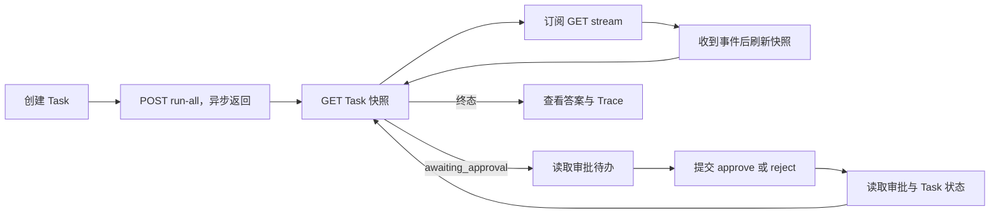

# Web UI：任务管理、Trace 可视化与审批操作台设计方案

> 状态：规划稿 · 2026-10-02
> 范围：浏览器端任务创建与管理、执行 Trace 阅读、人工审批；本文不包含实现代码。

## 1. 目标与边界

让租户操作员在一个工作台完成「创建任务 → 观察执行 → 查看依据 → 处理审批 → 确认结果」。任务与审批状态始终以服务端持久化数据为准；实时事件只用于加快刷新。

首版面向桌面浏览器，支持键盘操作和窄屏只读查看。界面展示业务执行记录 `Task.trace`，不把 OpenTelemetry Span 当作任务步骤。OTel 后端检索、可编辑 DAG、批量审批和可视化工作流编排留待后续阶段。

## 2. 现状与设计依据

| 能力 | 当前实现 | 对 UI 的影响 |
|---|---|---|
| 任务生命周期 | `POST/GET/DELETE /api/tasks`，`POST /:id/run-all`，`DELETE /:id/cancel`；状态为 `created/running/awaiting_approval/paused/completed/partial/failed` | 可直接搭建创建、列表、详情、运行、取消和单项删除 |
| 任务列表 | `GET /api/tasks` 支持 `status/session_id/limit/offset`；返回 `tasks/count/limit/offset`，`count` 是本页数量 | 没有总数、稳定的时间排序和游标；不能把 `count` 显示为全量任务数 |
| Trace | `GET /api/tasks/:id` 返回完整 `trace`；条目有 `step/action/agent_role/observation/error/evidence/token_usage` | 可展示顺序和筛选；没有每条记录的时间戳、耗时、父子关系或稳定事件 ID |
| 实时更新 | `GET /api/tasks/:id/stream` 推送步骤、token、审批、终态；事件总线为进程内、可丢中间事件，无历史重放；跨实例以存储轮询兜底终态 | 断线、切换实例和页面刷新后必须重新读取 Task；不能仅凭 SSE 构建完整 Trace |
| 审批操作 | `POST /api/tasks/:id/approve|reject` 支持 `approval_id/message/parameters`；`200` 表示本地处理，`202` 可能表示跨实例转发或后台恢复；冲突/过期为 `409/410` | 可操作已知审批 ID，但缺少独立的待办列表与详情读取接口；`202` 不能展示为「任务已继续执行」 |
| 审批持久化 | `DurableApprovalStore` 已保存租户、状态、版本和预览用 `Request`，原始操作/结果参数另行加密 | 新读接口必须重新审查预览脱敏，只暴露安全字段；不能序列化持久化对象或密文载荷 |
| 身份与审计 | API 支持 API Key、JWT、introspection 等；当前 `Principal` 主要只有租户和管理员标志 | 浏览器会话、审批人身份与细粒度审批角色需要设计和实现 |

相关实现：`docs/task-api.md`、`internal/api/handler.go`、`internal/api/sse.go`、`internal/api/task_approval_handler.go`、`internal/types/task.go`、`internal/store/store.go`。

## 3. 产品结构

```text
工作台
├─ 任务列表 /tasks
│  ├─ 创建任务
│  └─ 任务详情 /tasks/:id
│     ├─ 概览与执行操作
│     ├─ Trace 时间线
│     └─ 最终答案与质量审计
└─ 审批待办 /approvals
   └─ 审批详情 /approvals/:id（关联任务与 Trace）
```

### 3.1 任务列表与创建

- 列表展示任务 ID、目标摘要、状态、模式/Team、创建或更新时间、已用/最大步数、Token 预算、LLM 调用数和预估成本；支持状态与 Session 过滤、翻页、按 ID 跳转。已用 Token 需从详情 Trace 汇总，不能从当前 SQL 任务列表推断。首版只提供后端真实支持的筛选，不在客户端假造跨页全文搜索。
- 「新建任务」表单输入目标、工作区、模式、Team 和预算；工作区用租户允许的候选值或明确校验结果，Team 通过 `GET /api/teams` 获取并保留服务端校验。创建成功后跳转详情，运行由用户单独触发或通过明确的「创建并运行」动作串联两次请求。
- 状态操作按服务端结果启用：`created/paused` 可尝试运行；`running/awaiting_approval` 可取消；有最终答案的终态可尝试重新审计，非活动任务可删除。对于可恢复的特定 Multi-Agent 终态，展示「继续运行」需要新增后端能力字段，不能只按终态字面判断。
- 单项删除用明确二次确认；不在首版放置管理员「清空全部任务」入口。

### 3.2 任务详情与 Trace

- 顶部固定显示状态、目标、租户可见的 Team、预算使用、错误码/错误信息与主要动作。完成或部分完成时显示最终答案和 `answer_audit` 摘要；失败时显示 `error_code/error_message`，不把空答案误判为加载失败。
- Trace 时间线以 `Task.trace` 数组原顺序为准，标记数组序号、逻辑 `step`、角色、动作、观察、错误、证据和 Token 用量。多个审计记录可以共享同一 `step`，`step_count` 也不等于 Trace 条目数，因此不能用 `step` 去重或排序。
- 支持按角色、动作、错误和逻辑步数筛选；长文本默认折叠，证据展开后显示路径/查询/行内容。所有自由文本作为纯文本渲染，禁止直接注入 HTML/Markdown HTML。大 Trace 使用列表虚拟化和分段展开，避免浏览器主线程卡顿。
- 首版图形是「按记录顺序排列的时间线」，不显示伪造的时长柱、跨 Agent 因果箭头或 DAG 边。若将来加入 `event_id/occurred_at/duration_ms/parent_id`，再提供瀑布图和可验证的因果视图。
- OTel `trace_id` 当前主要出现在访问日志/Span 中，未作为任务可查询字段。后续可增加受权限控制的 Trace 深链接；UI 不根据任务 ID 猜测 OTel Trace ID。

### 3.3 审批待办与详情

- 待办显示审批 ID、任务 ID、动作、风险级别、租户、创建时间、状态；详情显示服务端提供的脱敏 `parameter_summary` 和 `preview`，并能跳转该任务的上下文 Trace。审批人确认前须看见实际要批准的动作、工作区和预览；预览缺失时不允许静默批准。
- 审批按钮分别提交批准或拒绝，始终带明确 `approval_id`；拒绝要求填写原因，批准可填写说明。首版不开放任意参数编辑；若业务确需替换参数，单独设计逐工具 schema、合法性校验、预览更新和二次确认。
- 提交后立即禁用该审批的重复提交按钮。收到 `200/202` 后重新拉取审批状态与任务状态；只有状态读取确认已流转，才显示「已批准/已拒绝」。`409` 提示已被他人处理并刷新，`410` 标记过期，`404` 显示不可见或不存在，`5xx/网络断开` 保留结果未知并允许查询后再决定是否重试。
- 审批请求不依赖当前浏览器最初打开的 SSE 连接。任务刷新、跨实例切换和后台恢复之后，待办仍可从持久化记录恢复。

## 4. 交互和状态同步



浏览器使用异步 `POST /run-all` 启动任务，再用独立 `GET /stream` 观察；不用 `POST /run-all?stream=true` 承载页面长期连接，因为该流断开会取消对应执行。进入详情、SSE 重连、标签页恢复、审批操作后均执行一次 `GET Task` 对账。SSE 只触发刷新或临时展示 token，不作为最终状态源；终态后关闭连接。长连接断开时显示「实时更新中断」，按退避策略重连并持续轮询持久化快照；SSE 无事件 ID，不能声称支持精确续传。若任务状态仍是 `awaiting_approval` 但审批已处理，展示「恢复中」，不自动重复提交批准或运行请求。

## 5. API 与数据契约增量

| 优先级 | 建议接口或改动 | 关键契约 |
|---|---|---|
| P0 | `GET /api/approvals?status=pending&limit=&cursor=` | 仅返回当前租户、当前主体有权处理的审批摘要；按 `created_at DESC, id DESC` 排序并使用不透明游标；不返回加密载荷、原始参数或跨租户记录 |
| P0 | `GET /api/approvals/:id` 与 `GET /api/tasks/:id/approvals` | 返回审批 ID、Task ID、状态、时间、版本及经重新审查脱敏的预览字段；任务级接口支持刷新后重新找到待办；不可见与不存在统一 `404` |
| P0 | 审批操作的主体与审计字段 | 后端从已验证身份得到稳定 `actor_id` 与租户，进行服务端授权；记录审批 ID、动作、操作者、决策时间、结果、关联 request/trace ID，不记录消息全文或替换参数 |
| P1 | `GET /api/tasks` 增加 `view=summary` 与稳定分页元数据 | 保留原接口兼容性；摘要不带 Trace/Memory 大字段，按 `created_at DESC, id DESC` 排序并返回 `has_more/next_cursor`。当前 `count` 仍只代表本页数量 |
| P1 | `GET /api/tasks/:id/trace?cursor=&limit=` | 为长 Trace 提供分页；保持服务端原始顺序，返回稳定事件序号/游标；不得仅以逻辑 `step` 做唯一键 |
| P1 | Task 允许动作字段 | 提供由后端判定的 `allowed_actions`，特别标识可恢复的 Multi-Agent 终态，避免前端复制编排状态机 |
| P2 | Trace 元数据与可观测性关联 | 逐条增加稳定 `event_id`、发生时间、可选耗时及父子关系；任务级增加可授权访问的 OTel 关联 ID，历史数据字段保持可选 |

新增查询建议放在现有 `/api` 鉴权与访问日志/恢复/追踪中间件覆盖之内。审批列表需要扩展 Store 查询接口，并分别实现 Memory、SQLite、PostgreSQL、Redis；数据库索引至少覆盖租户、状态、创建时间和审批 ID。当前预览构造会包含命令或拟写入内容，新增读接口前须审查敏感值脱敏和输出上限，统一生成专供 UI 使用的安全字段。版本用于服务端并发校验，UI 提交后仍以重新读取结果为准。审批状态的 `approved/rejected` 与 `consumed` 应在界面区分「决策已记录」和「恢复检查点已消费」。

当前 `GET /api/tasks` 在 SQL Store 中不附带 Trace，而 Redis Store 可能返回完整 Task；UI 不能依赖列表中的 `trace`。统一摘要契约后才能稳定控制列表传输量。API 文档与 `Sample/agent-api.http` 应随新增接口一起更新。

## 6. 前端与部署方案

建议新增 `web/` 存放 TypeScript 单页应用，采用组件化页面、集中 API 客户端和明确的服务端状态缓存。构建产物由同源网关或 Go 服务提供；浏览器对同源 `/api` 发请求，SSE 也走同源路径。开发环境代理到本地 API，生产环境不在静态资源中写入 API Key、上游 Token 或租户密钥。

浏览器身份接入需要一个服务端会话层（BFF/现有可信网关）：它与现有 JWT/introspection 或组织登录集成，向浏览器签发 `Secure`、`HttpOnly`、`SameSite` 会话 Cookie，服务端代持调用后端所需凭证。状态变更请求验证 CSRF Token/Origin；前端不从任意请求头自行声明租户、管理员或审批人。后端仍独立校验身份、租户和角色。现有 API Key 模式不适合作为浏览器端长期凭证；部署前先确定可信登录来源与服务端角色映射。

审批能力至少区分「任务查看者」「任务操作者」「审批人」「管理员」，按租户授权；是否允许创建者自批由产品策略显式配置并在后端检查。当前 `Principal` 未保存可审计的个人主体，不能仅靠 UI 隐藏按钮完成这项控制。文本预览、Trace 观察与最终答案都可能含敏感数据：默认脱敏、禁止客户端持久缓存，复制/导出需按权限控制；URL、浏览器日志和前端遥测不带审批参数或请求正文。

## 7. 交付顺序与验收

| 阶段 | 交付物 | 验收标准 |
|---|---|---|
| P0：可用操作台 | 登录会话与角色、任务列表/创建/详情、持久化 Trace 时间线、审批待办与详情、审批操作、状态对账 | 刷新或跨实例访问仍能找到审批；`202/409/410` 表现正确；审批竞争只能成功一次；租户之间任务、Trace、审批均不可见；SSE 断线后最终状态与持久化结果一致 |
| P1：容量与可用性 | 任务摘要分页、Trace 分页、更多过滤、长 Trace 虚拟列表、窄屏深度适配 | 大任务列表和长 Trace 不引起明显卡顿；静态数据集翻页无重复/漏项；列表不传完整 Trace；交互可用键盘完成 |
| P2：高级分析 | 事件时间与耗时、OTel 深链接、真实 DAG/Agent 关系视图、审批统计 | 图形关系与后端元数据一致；历史任务缺少元数据时降级为顺序时间线；深链接不绕过租户权限 |

实现时至少覆盖：任务状态矩阵；审批多项待办、并发决策、过期与后台恢复；SSE 中断/重连和跨实例；Trace 同一 `step` 多条记录；不同 Store 的列表一致性；浏览器会话、CSRF、XSS 与租户越权。后端新增并发/审批路径应跑针对性竞态测试，提交前运行 `go test ./...`。生产发布还需用共享 PostgreSQL/Redis 的双实例环境验证审批恢复和 SSE 终态对账。

## 8. 待定产品决策

1. 操作员身份来源与审批角色由哪个现有身份系统提供，以及是否禁止任务创建者自批。
2. 审批参数修改是否进入首版；若进入，先按具体工具确定允许修改的字段和预览规则。
3. 任务列表是否需要跨租户管理员视图；默认只展示当前租户，管理员跨租户查询必须有明确入口与审计。

这些决定影响授权模型和接口形状，不影响先完成任务只读页面、Trace 顺序视图与后端审批查询能力的设计验证。

## 9. 实施进度（2026-10-02）

P0 控制台、会话、审批读取与决策操作已落地。P1 已增加 Task 摘要游标分页、独立 Trace 游标分页、任务详情的 `allowed_actions`，页面改为按页读取并将筛选限定在当前页；窄屏 Trace 与翻页按钮也已适配。旧版 Task 列表及详情接口保持兼容。具体参数和响应见 [Task API](task-api.md)。

当前每页最多渲染 100 条 Trace，避免长列表占用大量 DOM；尚未引入独立的虚拟滚动组件。

P2 首批元数据已落地：分页 Trace 返回按 Task ID 与物理序号生成的 `event_id`，新事件记录首次持久化时间 `recorded_at`；历史记录没有可靠时间时省略。时间线展示时间与事件 ID。Task 详情持久化最近一次执行请求的 `execution_trace_id`（仅有效 OTel 上下文），便于在外部追踪系统手工检索。事件发生时间、耗时、父子关系、图形视图和 OTel 深链接仍需真实来源及部署侧追踪页面地址；页面不会推算这些数据。

后续已为 Redis 补充与完整 Task 原子更新的摘要索引、详情元数据和 Trace 列表。新任务的分页读取不再加载完整 Task；旧任务在首次摘要查询时迁移，直接读取尚未迁移的任务会回退到旧格式。完整 Task 与分页 Trace 仍双份保存，每次完整快照写入需重建 Trace 列表，因此极长任务的写放大仍需单独优化。滚动升级应先升级所有 Redis 写入实例，再启用新摘要查询。
