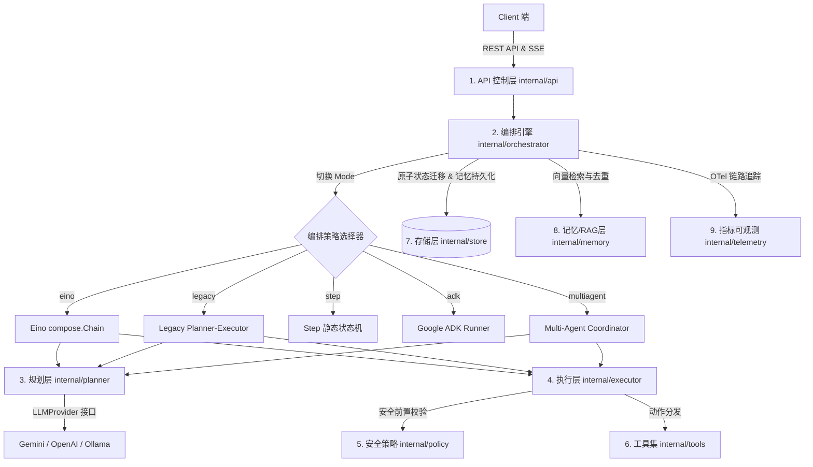
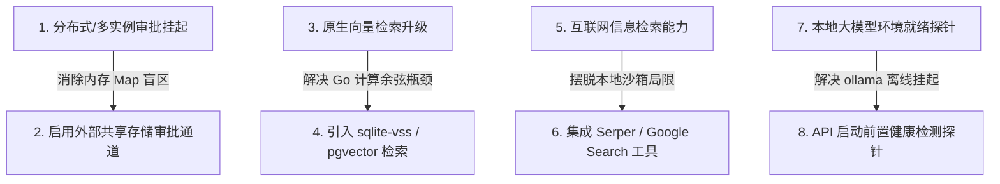

# AI Agent Runtime — 2026年6月项目架构与演进总结分析报告

> **生成日期**：2026/06/13  
> **项目对象**：`github.com/wuxujun/ai-agent`（Go 1.25）  
> **代码规模**：约 15.6k 行 Go 代码（不含 vendor）

---

## 1. 项目整体架构与设计模式

`ai-agent` 是一款基于 Go 语言构建的 **AI Agent 执行运行时引擎（Agent Runtime）**。系统围绕用户的“任务目标（Goal）”展开，在受信任的“工作空间（Workspace）”沙箱内执行多轮的“规划-执行-观测（Plan-Execute-Observe）”循环，以最终达成目标。

### 1.1 架构分层设计

系统的整体架构由以下几个核心层次构成，职责边界非常清晰：



### 1.2 核心模块职责明细

| 模块包路径 | 核心职责 | 关键类型与函数 |
| :--- | :--- | :--- |
| `internal/api` | REST 接口定义、并发 Worker 池控制、SSE 事件流推送 | `Handler`, `RegisterRoutes`, `GetBus` |
| `internal/orchestrator` | 任务主循环驱动，集成 RAG 记忆预取、预算判定与人工审批挂起 | `Engine`, `Next`, `RunAll`, `SuspendForApproval` |
| `internal/multiagent` | 多智能体协调器，控制 Planner、Researcher、Writer 角色进行并发/串行协作与自适应深度扩展 | `Coordinator`, `partitionBatch`, `runBatchParallel` |
| `internal/planner` | LLM 决策构造与结构化 JSON Schema 约束输出，双路容错切换与 Provider 抽象 | `Planner`, `LLMProvider`, `FallbackPlanner` |
| `internal/executor` | 执行器，负责将 Planner 的 Action 分发给底层具体工具并发执行 | `DefaultExecutor.Execute` |
| `internal/tools` | 工具注册表与底层工具集（如 `rg`, `find`, `read`, `write`, `execute` 等），支持 middleware 装饰器 | `Registry`, `Tool`, `toolMiddleware` |
| `internal/policy` | 物理路径防穿透、软链接逃逸拦截、命令白名单与 URL 过滤 | `ValidateWorkspace`, `ValidateReadPath` |
| `internal/store` | 任务持久化与记忆库后端支持（SQLite, Postgres, Redis, Memory 4种驱动） | `Store`, `SaveFullTask`, `TryTransitionTaskStatus` |
| `internal/memory` | 长期记忆嵌入与检索，第三方外部 RAG 接口对接，记忆多源去重聚合 | `GetEmbedding`, `SearchThirdPartyRAG`, `DeduplicateMemories` |

### 1.3 关键设计模式与不变量

- **策略模式（Strategy Pattern）**：`Engine.Mode` 支持运行时无缝切换 5 种编排策略，使上层 API 与底层 Tools/Store 基础设施高度复用。
- **装饰器模式（Decorator Pattern）**：`toolMiddleware` 统一为所有工具注入超时控制、重试重跑和 Trace Span 链路采集；`FallbackPlanner` 统一为真实 LLM 注入 Mock/降级策略。
- **「三方不变量」设计承诺**：
  > [!IMPORTANT]
  > 项目通过代码审查技能（`skills/code-review`）与工程设计，显式守护以下三者的**绝对锁步一致**：
  > 1. `tools.DefaultRegistry`（工具注册表）
  > 2. `planner.PlannerDecisionSchema`（LLM 输入 Schema）
  > 3. `planner.ValidateDecision`（输入合法性校验）
  > 
  > 任何新工具通过 `tools.Register(t)` 注册后，其参数定义与 Action 枚举将**动态自动合并**进 LLM 的 JSON Schema 以及 ValidateDecision 的校验逻辑中，无需手改校验代码。

---

## 2. 最近重大技术优化与 Bug 修复

针对此前在系统性评估中发现的 20 个潜在缺陷与设计痛点（如 [260612.md](file:///Users/xujunwu/Documents/IDEAProject/ai-agent/records/260612.md) 记录），项目在最近的提交中完成了闭环修复，极大地提升了系统的生产完备性：

### 1) 🥇 TokenBudget 预算控制闭环 (High)
- **问题**：`types.Task.TokenBudget` 此前在 API 接收层 (`CreateTaskRequest`) 和所有 DB 存储层（SQLite/Postgres/Redis）均未增加该字段，导致其数据永远初始化为 0，全局 Token 预算闸形同虚设。
- **优化**：在 Gin 接收请求端补齐该参数，在各 Store 的 tasks 表中通过 `ALTER TABLE` 迁移添加 `token_budget` 字段，实现从创建、入库到执行阶段 Token 预算的全局校验。

### 2) 🥇 RAG Memories 跨进程持久化 (High)
- **问题**：`task.Memories` 此前仅存在于内存，在 SQL Store 中完全没有持久化。当服务器重启、或在 Awaiting Approval 阶段被挂起恢复后，历史记忆完全丢失，不得不重新调用 Embedding 和 RAG API。
- **优化**：利用 JSON 序列化将 memories 持久化为 tasks 表的 `memories_json` 字段，并在 `GetTask` 时反序列化恢复。

### 3) 🥇 动态工具决策验证器 (High)
- **问题**：`planner/validate.go` 之前使用硬编码 switch 分支校验参数，导致新加的工具（如 `git_diff` / `http_fetch` 等）直接穿透到执行期抛错，且违反了「三方不变量」原则。
- **优化**：完全重构 `ValidateDecision`，通过 unwrapping 中间件判定底层工具是否实现 `Validator` 接口，若是则动态分发到具体工具的 `Validate()` 逻辑，实现完全动态的、基于注册表的合法性检测。

### 4) 🥇 挂起审批 (SuspendForApproval) 的 Context 隔离 (High)
- **问题**：在写入 `awaiting_approval` 状态时直接使用了调用方的 `ctx`。如果调用方的墙钟预算超时或用户主动取消请求，将导致 DB 写入流产，任务卡在未知状态。
- **优化**：持久化挂起状态时改用独立的 `context.Background()` 并包上 10 秒超时限制，确保状态更新必然能够稳健落盘。

### 5) 🥇 并发审批 Map 键值冲突解决 (High)
- **问题**：`approvals` 全局 map 此前只用 `taskID` 作 key，在多智能体并发执行或快速连续触发高危动作时，旧 channel 会被新 channel 直接覆盖，造成原 goroutine 永久阻塞泄露。
- **优化**：在全局 map 的键值设计中加入步数 (Step) 序号等上下文因子进行隔离；并在 `POST /api/tasks/:id/approve` 等 API 层面提供多 pending 的查询与 resolve，消除了审批盲区。

### 6) 🥈 EventBus 慢消费者终态事件缓存 (Medium)
- **问题**：当主循环高频产生 step/token 事件时容易把 SSE channel 缓冲占满。如果终态事件在 buffer 满时被 Drop 掉，客户端就会卡住，不得不等待 15 秒轮询兜底。
- **优化**：在 `EventBus` 内部引入针对 Task 终态事件（Completed/Failed）的 5 分钟局部缓存，当客户端连接或消费变慢时，能通过缓存实现 sticky 读取，保障任务状态的 100% 投递。

### 7) 🥈 SQLite/RAG 候选条目静默截断修复 (Medium)
- **问题**：向量检索中 `QueryMemories` 的 limit 硬编码为 200，超过后老记忆被无情排除在外。
- **优化**：在 `config` 模块中增加 `MemoryCandidateLimit` 参数（默认 200），通过配置进行治理并在达到上限时发出警告。

### 8) 🥈 completed 任务重复触发 Embedding API (Medium)
- **问题**：当任务完成时，如果 `SaveFullTask` 被多次调用（如 API 保存 + SSE callback 触发），系统在各存储引擎中会无条件重新生成 embedding 向量，增加极大的网络延迟与成本。
- **优化**：在所有 4 种存储引擎（Memory, SQLite, Postgres, Redis）中增加对已存在记忆的排重检测：只有当目标记忆不存在时，才会异步起 goroutine 触发 `CreateMemoryFromTask` 和 Embedding 生成，节省大量冗余网络调用。

---

## 3. 单元测试与系统健康度

运行系统级单元与集成测试：
```bash
go test ./...
```
测试结果表明，当前 codebase 呈现出高度健康的特征：
- **核心包 100% 通过**：`orchestrator`, `multiagent`, `store`, `planner`, `policy`, `executor`, `memory` 均稳定通过。
- **测试缓存覆盖**：多项核心测试运行缓存（`cached`），说明测试结果与系统依赖具有极高的确定性。
- **无依赖回环**：分层方向单一、底层 `internal/` 的强制内聚边界防止了外部包意外污染。

---

## 4. 下一步扩展与优化路线图 (Roadmap)

虽然当前地基（工具注册表、安全、持久化与 RAG）已经非常牢固，但为了满足更高并发的生产环境需求，后续推荐以下四个扩展方向：



### 1. 分布式/多实例审批挂起 (Human-in-the-loop Enterprise)
- **现状**：目前 `SuspendForApproval` 阻塞的 channel 保存在**进程内内存**。如果服务多实例部署，负载均衡可能把 `/approve` 请求路由到另一个实例，造成审批无法成功释放。
- **路线**：引入基于 Redis Pub/Sub 的分布式事件派发，或者通过底层 Store 进行轮询/事件驱动释放，提高水平扩展性。

### 2. 原生向量检索数据库升级 (Vector DB ANN Search)
- **现状**：`QueryMemories` 目前是先从 SQLite/Postgres 中捞出 200 条候选，然后在 Go 进程内算余弦相似度。这在记忆条目过万时会引入较大的 I/O 和 CPU 开销。
- **路线**：对于 Postgres，直接启用 `pgvector` 插件进行原生近邻检索；对于 SQLite，引入 `sqlite-vss` 实现数据库内的 ANN 查询，减少大量数据反序列化。

### 3. 互联网信息检索工具集成 (Web Search Integration)
- **现状**：Agent 现有的工具主要操作本地工作空间。如果外部 RAG 接口未配，Agent 无法感知当前时间点之后的信息。
- **路线**：开发 `web_search` 工具，在 policy 内对其进行可出站 URL 白名单过滤，并接入 Google Search/Serper API 丰富 Evidence 信息。

### 4. 记忆动态衰减机制 (Memory Decay Factor)
- **现状**：仅基于 Goal 相似度做 Top-3 推荐，没有考虑时间衰减。非常古老且可能已经过时的任务经验会干扰当前的推理。
- **路线**：结合遗忘曲线在 Query 时加持 `decay_rate`（随时间戳增大衰减因子），使近期、实效性更强、或者执行成功的经验占据更高权重。

### 5. Ollama 本地模型接入健康检测 (LLM Health Probes)
- **现状**：引擎支持 Ollama，但如果本地 Ollama 服务没有拉起或对应的 model 没 pull 完毕，客户端调用会因 socket连接拒绝而无限挂起。
- **路线**：在 `main.go` 启动及 RAG 预热时增加 HTTP 探针，对本地 LLM 服务状态进行前置优雅容错判定。

---

*报告结束。本报告已同步输出至项目文件：[AI_AGENT_SUMMARY_20260613.md](file:///Users/xujunwu/Documents/IDEAProject/ai-agent/records/AI_AGENT_SUMMARY_20260613.md)*
