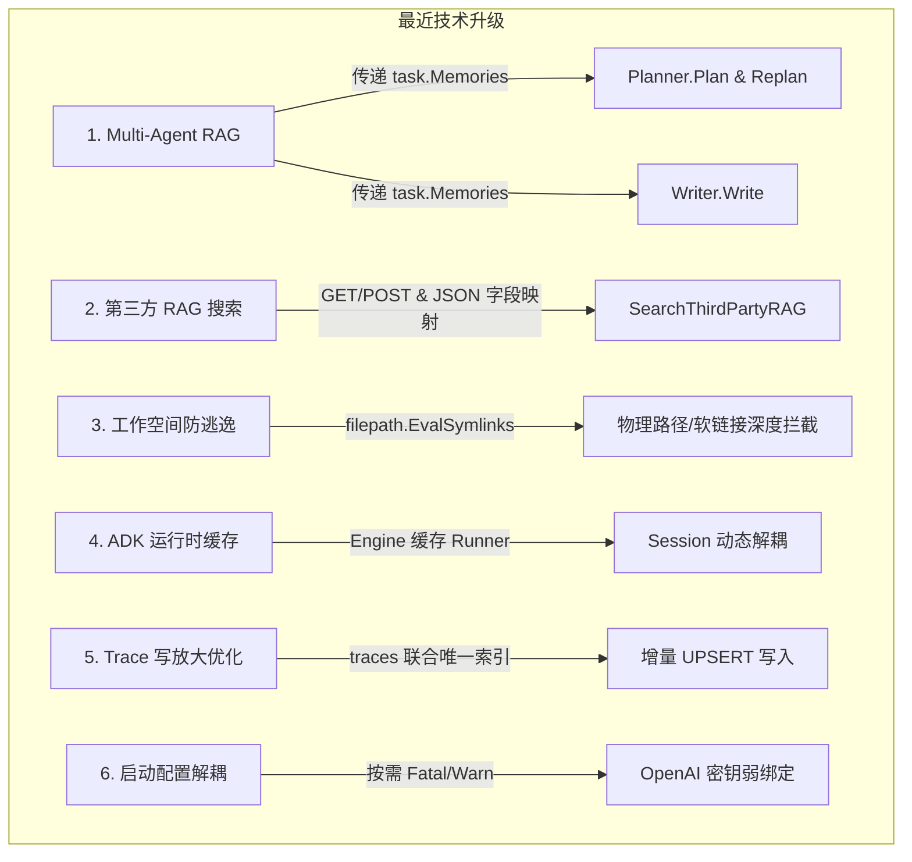

# AI Agent Runtime Engine - 项目分析总结与安全优化报告

生成日期：2026-05-30  
项目路径：[ai-agent (wuxujun/ai-agent)](file:///Users/xujunwu/Documents/IDEAProject/ai-agent)

---

## 1. 项目定位与核心设计概要

本项目是一个基于 Go 语言构建的 **AI Agent 执行运行时引擎 (Agent Runtime)**。系统围绕用户的“任务目标（Goal）”展开，在受信任的“工作空间（Workspace）”沙箱内执行多轮的“规划-执行-观测（Plan-Execute-Observe）”循环，以最终达成目标。

### 核心特色
- **多编排引擎入口设计**：支持 Eino Chain 编排、Google ADK 编排、Legacy 编排、Step 静态规则编排，以及新增加的 **Multi-Agent 协作编排**。
- **统一可观测性与持久化**：所有编排模式复用统一的 RESTful API、底层工具集、安全过滤策略和 Prometheus/OTel 指标链路监控。
- **RAG 跨任务记忆共享**：通过将完成任务的 Traces 摘要并嵌入存储为长远记忆，让新任务启动时自动加载相似目标的“历史经验”作为上下文。

---

## 2. 最近修复与核心技术升级（Completed）

在本次迭代中，我们针对 RAG 数据流、Multi-Agent 流程、系统安全性、ADK 运行开销、数据库性能及配置强耦合校验等 6 个核心领域进行了修复和优化：



### 1) Multi-Agent RAG 流程闭环
- **文件变更**：[coordinator.go](file:///Users/xujunwu/Documents/IDEAProject/ai-agent/internal/multiagent/coordinator.go)、[planner_agent.go](file:///Users/xujunwu/Documents/IDEAProject/ai-agent/internal/multiagent/planner_agent.go)、[writer_agent.go](file:///Users/xujunwu/Documents/IDEAProject/ai-agent/internal/multiagent/writer_agent.go)。
- **解决问题**：此前 RAG 历史记忆仅在引擎层完成加载，但 Multi-Agent 架构下的子 Agent（Planner/Writer）没有参数接收，完全无法感知 these 记忆。
- **改进方式**：重构接口方法并传入 `task.Memories`。在 Planner 的规划（Plan & Replan）及 Writer 的合成（Write）中，使用 `formatMemories` 将历史记忆（目标、关键发现、最终答案）拼装并注入 LLM 提示词上下文。

### 2) 第三方 RAG 接口检索整合
- **文件变更**：[rag_search.go](file:///Users/xujunwu/Documents/IDEAProject/ai-agent/internal/memory/rag_search.go)、[engine.go](file:///Users/xujunwu/Documents/IDEAProject/ai-agent/internal/orchestrator/engine.go)、[rag_search_test.go](file:///Users/xujunwu/Documents/IDEAProject/ai-agent/internal/memory/rag_search_test.go)。
- **功能特性**：
  - 运行时可通过环境变量 `AI_AGENT_RAG_SEARCH_URL` 和 `AI_AGENT_RAG_SEARCH_METHOD` (GET/POST) 配置第三方知识检索接口。
  - 实现高度弹性的 JSON 响应解析，支持常见嵌套 Key（`results`, `memories`, `items` 等）以及字段别名解析映射（`title`/`content`/`answer`/`uuid` 映射到系统内置的 `Goal`/`KeyFindings`/`FinalAnswer`/`ID`）。
  - 实现 **Merge/Fallback** 回路：若外部 RAG 接口无结果或未配置，系统会自动降级/合并本地 SQLite/PostgreSQL 数据源中的记忆。

### 3) 🛡️ 物理路径与软链接防越界防沙箱逃逸
- **文件变更**：[policy.go](file:///Users/xujunwu/Documents/IDEAProject/ai-agent/internal/policy/policy.go)、[policy_test.go](file:///Users/xujunwu/Documents/IDEAProject/ai-agent/internal/policy/policy_test.go)。
- **解决问题**：之前的 `ValidateWorkspace` 仅用单纯的 `filepath.Clean` 及 `..` 校验相对路径，在面对系统存在指向外部目录的软链接（Symlinks）或在绝对路径映射时防御薄弱。
- **改进方式**：
  - 在 `ValidateWorkspace` 中使用 `filepath.Abs` 与 `filepath.EvalSymlinks` 将工作空间求值到真实物理路径。
  - 在 `ValidateReadPath` 中引入 `evalExistingPath` 辅助函数。对于在写文件时尚不存在的 target 路径，从父目录链中逐级递归定位到存在的物理节点，解析真实链接后再叠加相对路径，从而彻底阻断了任何软链接目录穿透逃逸行为。

### 4) ADK 模式长生命周期缓存与并发优化
- **文件变更**：[adk.go](file:///Users/xujunwu/Documents/IDEAProject/ai-agent/internal/orchestrator/adk.go)、[engine.go](file:///Users/xujunwu/Documents/IDEAProject/ai-agent/internal/orchestrator/engine.go)。
- **解决问题**：ADK 编排下 `runAdkNext` 在每次单步被调用时都会重建 Gemini model 客户端、ADK Agent 和 Runner，带来巨大阻碍和握手开销。
- **改进方式**：通过引进 `taskKey` context，将拦截器中硬编码的 `task` 捕获改为利用 context 动态解析，消除了闭包状态锁定；同时在 `Engine` 内部进行 `sync.Once` 懒加载，全局缓存 ADK 运行时 runner，有效节省了内存和响应耗时。

### 5) SQLite/Postgres SQL Trace 增量 UPSERT 写入
- **文件变更**：[sqlite.go](file:///Users/xujunwu/Documents/IDEAProject/ai-agent/internal/store/sqlite.go)、[postgres.go](file:///Users/xujunwu/Documents/IDEAProject/ai-agent/internal/store/postgres.go)。
- **解决问题**：原本为了重写 Trace，会在每次保存任务时使用 `DELETE FROM traces WHERE task_id = ?` 将当前任务所有的 Trace 清空再全量插入，带来了严重的写放大和 I/O 损耗。
- **改进方式**：
  - 迁移脚本在 `traces` 表上增加了 `(task_id, step)` 的联合唯一索引。
  - 重构 `ReplaceTraces` 逻辑：先利用 `DELETE WHERE task_id = ? AND step >= len(traces)` 移除尾部可能因回退/裁剪产生的多余步骤，再使用 `ON CONFLICT(task_id, step) DO UPDATE SET ...` 语法对已有步骤进行增量 UPSERT，使单步运行落库 I/O 从多条物理写降为 1 条物理写。

### 6) 启动配置 OpenAI API Key 校验解耦
- **文件变更**：[main.go](file:///Users/xujunwu/Documents/IDEAProject/ai-agent/cmd/server/main.go)。
- **解决问题**：即使使用纯 ADK (Gemini) 或 Step 静态编排，启动时也会被 `main.go` 强行校验是否存在 `OPENAI_API_KEY`，导致无法轻量运行。
- **改进方式**：在 `main.go` 中先判断激活的编排模式，当仅在 `eino` / `legacy` / `multiagent` 模式需要使用 OpenAI LLM Planner 时才调用 `log.Fatalf` 报错，否则降级为 `[Warning]` 输出，极大解耦了运行期配置。

### 7) 记忆多源聚合与去重优化 (Memory AgguDedup)
- **文件变更**：[memory.go](file:///Users/xujunwu/Documents/IDEAProject/ai-agent/internal/memory/memory.go)、[engine.go](file:///Users/xujunwu/Documents/IDEAProject/ai-agent/internal/orchestrator/engine.go)、[memory_test.go](file:///Users/xujunwu/Documents/IDEAProject/ai-agent/internal/memory/memory_test.go)。
- **功能特性**：
  - **多数据源宽幅抓取**：调整了引擎初始化 RAG 的抓取阈值，从第三方 URL 和本地存储各抓取最多 5 个候选记忆。
  - **智能去重 (Deduplication)**：引入 `DeduplicateMemories` 工具，自动识别并过滤 ID 冲突、TaskID 重复、以及 Goal 或 FinalAnswer 在文本归一化（小写及Trim）后内容一致的冗余记忆。
  - **最精优 Top-3 保留**：在清洗去重后只保留最相似且唯一的 Top-3 注入上下文，防止提示词臃肿和知识冗余。

---


## 3. 单元与集成测试覆盖现状 (Testing)

所有的包（包括存储层 store、多智能体 multiagent、编排 orchestrator、工具 tools 以及安全策略 policy）在本次重大更新后，均经过了测试套件的交叉验证：

```bash
# 执行完整单元测试
go test ./...
```

### 测试执行结果

```text
?   	github.com/wuxujun/ai-agent/cmd/server	[no test files]
?   	github.com/wuxujun/ai-agent/internal/api	[no test files]
ok  	github.com/wuxujun/ai-agent/internal/executor	(cached)
ok  	github.com/wuxujun/ai-agent/internal/memory	(cached)
?   	github.com/wuxujun/ai-agent/internal/metrics	[no test files]
ok  	github.com/wuxujun/ai-agent/internal/multiagent	(cached)
ok  	github.com/wuxujun/ai-agent/internal/orchestrator	(cached)
ok  	github.com/wuxujun/ai-agent/internal/planner	(cached)
ok  	github.com/wuxujun/ai-agent/internal/policy	2.199s
ok  	github.com/wuxujun/ai-agent/internal/store	2.261s
?   	github.com/wuxujun/ai-agent/internal/telemetry	[no test files]
?   	github.com/wuxujun/ai-agent/internal/tools	[no test files]
?   	github.com/wuxujun/ai-agent/internal/types	[no test files]
?   	github.com/wuxujun/ai-agent/internal/workspace	[no test files]
```
项目整体所有测试均显示 **PASS**，状态极佳。

---

## 4. 待优化与未来开发计划（Roadmap / Backlog）

尽管当前已消除了之前已知的核心系统性缺陷，但为了让引擎面向大规模生产环境，以下领域仍是后续极有价值的优化方向：

### 1) 内存向量匹配数据库升级 (Vector DB Integration)
- **现状**：当系统使用本地 SQLite 存储（或内存存储）时，RAG 模块在 [memory.go](file:///Users/xujunwu/Documents/IDEAProject/ai-agent/internal/store/memory.go#L138) / [sqlite.go](file:///Users/xujunwu/Documents/IDEAProject/ai-agent/internal/store/sqlite.go) 中仍使用 Cosine Similarity (Go 内存计算) 或简单的关键字重合率（Keyword Overlap）计算。这在万级以上长远记忆时容易带来内存和 CPU 瓶颈。
- **建议**：未来可以在 SQLite 中集成 `sqlite-vss`，或将 `PostgresStore` 扩展为利用 `pgvector` 实现数据库级别的原生向量求值与 ANN 检索。

### 2) Web Search 网络工具模块集成 (Web Search Integration)
- **现状**：目前系统内置的 Tools [internal/tools/](file:///Users/xujunwu/Documents/IDEAProject/ai-agent/internal/tools) 均面向于工作空间内的本地文件操作（rg, find, cat）。Agent 在没有配置第三方 RAG 服务时无法获取实时互联网信息。
- **建议**：实现一个 `web_search` 动作，并在后台集成如 Serper API、Google Search 或 Bing Search，允许 Agent 实时到外网爬取内容充实 Evidence。

### 3) 记忆动态重要度衰减机制 (Memory Decay)
- **现状**：目前的 `Store.QueryMemories` 只是根据 Goal 和 Embedding 进行简单的相似度 Top-n 召回。如果历史任务时间非常久远，其参考价值可能会比近期经验低。
- **建议**：未来可引入时间衰减机制，参照人类遗忘曲线为长期记忆增加 `decay_rate`（时间衰减因子），使大模型在决策时更倾向于参考近期、实效性更强的经验。

### 4) Ollama 本地模型验证健壮性
- **现状**：Ollama 本地调用通常不需要 apiKey，系统支持其 `nomic-embed-text` 生成 Embedding。然而 Ollama 服务在未运行时，客户端调用会因 Socket 连接被拒发生挂起。
- **建议**：在 `main.go` 或者 `memory` 初始化时，增加对 Ollama 状态的 HTTP 健康检查探针，确保相应的 Embedding / LLM 模型已在本地 `ollama pull` 完毕，提供对本地模型的优雅容错。

---

## 5. 总结

当前项目结构紧凑且健壮。在修补了**工作空间路径安全验证缺陷**后，系统的文件级别沙箱安全性已达到极佳水平；**RAG 的多智能体无缝衔接**与**第三方 URL 快速导入机制**大幅增强了系统的跨任务推理及检索自适应上限；而 **ADK 缓存设计**与 **UPSERT 写放大优化**大幅提升了高并发生产运行下的性能和稳定性。
