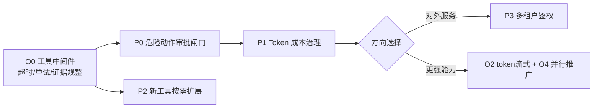

# AI Agent Runtime — 现状总结与下一步路线图

> 生成日期：2026-06-02 ｜ 基于工具注册表化完成后的最新代码状态

---

## 一、当前能力快照（已达成）

经过最近几轮迭代，引擎已经具备一条完整且解耦良好的主干：

- **多编排引擎**：Eino / Legacy / ADK / Step / Multi-Agent 五种 Mode，共享同一套工具、存储、安全、可观测性骨架。
- **工具注册表（本轮新增）**：`Tool` 接口自描述参数，`init()` 自注册；OpenAI / Gemini / multi-agent **三条规划链路的 action 枚举全部从注册表派生**。新增工具 = 写一个文件 + 注册，零散改动消失。当前 8 个工具：`find_files / search_text / read_file / write_file / execute_code / git_diff / http_fetch / web_search`。
- **安全**：工作空间防穿透（`EvalSymlinks`）、命令白名单、出站 URL 的 SSRF 防护（`ValidateURL`）。
- **RAG 跨任务记忆**：第三方检索 URL + 本地向量库，多源聚合去重。
- **存储多后端**：SQLite / Postgres / Redis / Memory，统一 `Store` 接口，Trace 增量 UPSERT。
- **可观测性**：OTel 链路 + 指标 + 结构化日志 + SSE 实时推送。
- **性能**：Research Phase 并发化、ADK Runner 缓存、Gemini 客户端连接池（`gemini_pool.go`）。

**一句话定位现状**：地基（编排/工具/存储/安全/可观测）已经扎实，下一阶段的杠杆从"打地基"转向"加治理能力"和"提质量"。

---

## 二、下一步扩展功能（新增能力，按优先级）

### 🥇 P0 — 危险动作审批闸门（Human-in-the-loop）
**动机**：工具集已开放且含 `execute_code` / `write_file`，攻击面随工具增多而放大，但目前 `run-all` 一路跑到底，无任何人工确认点。这是安全与可控性的最大缺口。
**做法**：
- 在 `types.Task` 增状态 `StatusAwaitingApproval`；Executor 执行前对"高危动作"（可在 `Tool` 接口加 `RiskLevel()` 或维护高危集合）挂起。
- API 增 `POST /api/tasks/:id/approve` 与 `/reject`；复用既有 SSE 推送审批请求。
- 高危判定与工具注册表打通：新增工具声明自身风险等级，闸门自动生效。
**收益**：让"工具开集"变得可安全交付，是对外提供服务的前置条件。

### 🥈 P1 — 成本与配额治理（Token / Tool Budget）
**动机**：现有 `ToolBudget` 只数工具调用次数，没有 token 维度。LLM 成本不可见、不可限。
**做法**：
- 统计每步 prompt/completion token，落库到 Trace；扩展为 `TokenBudget`，超限即停。
- 指标层（已有 OTel）暴露 per-task / per-mode 的 token 与费用估算。
- 可选：按租户/任务限速。
**收益**：成本可观测、可控，平台化必备。

### 🥉 P2 — 工具能力扩展（沿注册表低成本铺开）
注册表已铺平路，下面这些只需各加一个文件：
- **结构化数据工具**：`sql_query`（只读连库）、`json_query`（jq 风格）。
- **代码工具**：`apply_patch`（比 write_file 更安全的补丁式修改）、`run_tests`。
- **检索增强**：`vector_search`（直连向量库，见 P4）。
建议每个新工具同时声明 `RiskLevel()`（配合 P0）。

### P3 — 多租户与鉴权
**动机**：当前 API 无认证、Task 无 owner、Workspace 路径直接来自请求。
**做法**：认证中间件 + Task 租户隔离 + Workspace 按租户命名空间化。从"单机工具"走向"平台"的必经之路。

---

## 三、下一步优化内容（现有能力打磨，按优先级）

### 🔧 O0 — 工具执行的统一中间件（超时/重试/证据规整）
**现状问题**：`RunCommand` 有统一超时，但 `http_fetch` / `web_search` 各自硬编码 10s/15s，未读 `AI_AGENT_TOOL_TIMEOUT_SECONDS`；无统一重试；不同工具的 `ToolResult` 证据丰富度不一致（单 Agent 的 `find_files` 不产 Evidence，multi-agent 却产）。
**做法**：在 Executor 与注册表之间加一层中间件——统一注入超时 ctx、可配置重试、统一截断与证据规整。让所有工具行为一致。
**收益**：消除 multi-agent 仍保留专用分支的根因，最终把那 5 个特例也收敛进注册表。

### 🔧 O1 — 向量检索性能（规模触发）
**现状问题**：`Store.QueryMemories` 在关系库里是"取出再算余弦相似度"，记忆量上万会成为瓶颈。
**做法**：接专用向量库（Qdrant / Milvus / pgvector），或在 Postgres 启用 `pgvector` 扩展做近邻检索。封装为 `Store` 的新实现，对上层透明。
**触发条件**：长期记忆条目过万再动手，当前不紧迫。

### 🔧 O2 — 流式输出下沉到 token 级
**现状**：SSE 推的是 step 级事件。
**做法**：在 LLM Provider 层接入 streaming，token 级增量经 SSE 透传，前端可见"思考中"。提升交互体验。

### 🔧 O3 — 收口 TODO 占位与回退质量
**现状**：`planner/mock.go:28` 与 `orchestrator/engine.go:356` 仍返回字面量 `"TODO"`。
**做法**：审视这些回退路径，给出合理默认或明确错误，避免 "TODO" 泄漏到 Trace / 最终答案。

### 🔧 O4 — 并行化推广
**现状**：仅 Research Phase 并发。
**做法**：把独立子目标（无数据依赖的 step 批）推广到更广的并行执行，配合 O0 的超时/重试中间件更稳。

---

## 四、推荐的下一步落地顺序（一个迭代视角）

**建议从 O0 起步**：它既是质量优化、又是 P0 审批闸门和 P2 新工具的承载层（统一在中间件里挂风险判定、超时、重试），一处投入多处复利。随后做 P0 审批闸门把"工具开集"变安全，再做 P1 成本治理让消耗可控。O1 向量库属规模触发，按数据量决定时机。

---

## 五、一句话结论
地基已成，重心转向**治理（审批 + 成本 + 租户）**与**打磨（统一工具中间件 + 流式 + 向量性能）**。其中"工具执行统一中间件（O0）"是性价比最高的起点——它同时解决一致性优化、并成为审批闸门与未来工具的公共承载层。
