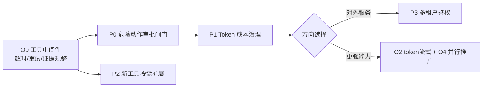

# AI Agent Runtime — 现状总结与下一步路线图

> 生成日期：2026-06-02 ｜ 基于工具注册表化完成后的最新代码状态

---

## 一、当前能力快照（已达成）

经过最近几轮迭代，引擎已经具备一条完整且解耦良好的主干：

- **多编排引擎**：Eino / Legacy / ADK / Step / Multi-Agent 五种 Mode，共享同一套工具、存储、安全、可观测性骨架。
- **工具注册表**：`Tool` 接口自描述参数，`init()` 自注册；OpenAI / Gemini / multi-agent **三条规划链路的 action 枚举全部从注册表派生**。当前 19 个运行时工具，覆盖文件检索/读写、补丁、受限测试、HTTP/Web、SQL/JSON、技能与 RAG/Memory 两阶段检索。
- **安全**：工作空间防穿透（`EvalSymlinks`）、命令白名单、出站 URL 的 SSRF 防护（`ValidateURL`）。
- **RAG 跨任务记忆**：第三方检索 URL + 本地向量库，多源聚合去重。
- **存储多后端**：SQLite / Postgres / Redis / Memory，统一 `Store` 接口，Trace 增量 UPSERT。
- **可观测性**：OTel 链路 + 指标 + 结构化日志 + SSE 实时推送。
- **性能**：Research Phase 并发化、ADK Runner 缓存、Gemini 客户端连接池（`gemini_pool.go`）。

**一句话定位现状**：地基（编排/工具/存储/安全/可观测）已经扎实，下一阶段的杠杆从"打地基"转向"加治理能力"和"提质量"。

---

## 二、下一步扩展功能（新增能力，按优先级）

### 🥇 P0 — 危险动作审批闸门（Human-in-the-loop）
**状态**：~~已完成。`StatusAwaitingApproval`、按 approval ID 并发安全挂起、approve/reject API、SSE 审批预览、参数修改、RiskLevel 注册表自动闸门、跨实例 Redis Pub/Sub 信号均已实现。High Risk 工具禁止自动重试并强制串行。~~

### 🥈 P1 — 成本与配额治理（Token / Tool Budget）
**状态**：~~已完成。Task/Trace 记录 prompt、completion、total token 与估算费用；支持 Tool/Token/LLM Call/Cost 四类任务预算、按租户每日 Call/Cost 配额、Scene 保留预算、并行前瞻裁剪、OTel/metrics 用量观测和 `/api/usage`。~~

### 🥉 P2 — 工具能力扩展（沿注册表低成本铺开）
**状态**：~~已完成。~~
注册表已铺平路，下面这些只需各加一个文件：
- **结构化数据工具**：~~`sql_query`（只读连库）~~、~~`json_query`（RFC 6901 JSON Pointer）~~。
- **代码工具**：~~`apply_patch`（比 write_file 更安全的补丁式修改）~~、~~`run_tests`（受限 Go 测试）~~。
- **检索增强**：~~`vector_search`（已由 `memory_search → Store.QueryMemories` 覆盖；ParadeDB 模式下为 BM25 + pgvector + RRF）~~。
建议每个新工具同时声明 `RiskLevel()`（配合 P0）。

### P3 — 多租户与鉴权
**状态**：~~已完成。支持 API Key、JWT/JWKS、Token Introspection 与 Hybrid 认证；Task / Session / Memory / Audit / Usage 均按租户隔离。租户可配置 `workspace_root`，任务 Workspace 越界返回 `403`；生产环境可启用 `require_tenant_workspace_root` 强制所有非管理员租户声明边界。~~

---

## 三、下一步优化内容（现有能力打磨，按优先级）

### 🔧 O0 — 工具执行的统一中间件（超时/重试/证据规整）
**状态**：~~已完成。所有注册工具自动经过 `toolMiddleware`：统一读取热更新 timeout、按工具 RetryPolicy 重试（High Risk 禁止自动重试）、传播取消、UTF-8 修复、4 KiB 安全截断；ToolResult/Evidence 契约统一。Planner/Executor/Multi-Agent 均从同一注册表派生。~~

### 🔧 O1 — 向量检索性能（规模触发）
**状态**：~~已完成。Postgres 支持 pgvector 数据库内向量排序与可选 HNSW，ParadeDB 模式进一步提供 BM25 + pgvector + RRF 混合检索；候选倍率、RRF K、慢查询阈值可热更新，并已具备分阶段指标、fallback 与基准测试。其他后端继续使用有界 in-process 路径。~~

### 🔧 O2 — 流式输出下沉到 token 级
**状态**：~~已完成。Legacy / Eino 的 OpenAI Chat、LiteLLM、Gemini、Ollama 与 OpenAI Responses、ADK Partial 均接入统一 TokenCallback；结构化 JSON 只提取 `final_answer`。Multi-Agent 的 LiteLLM/OpenAI Chat Structured Transport 支持 SSE delta，但答案 chunk 会缓冲到草稿被接受/独立验证通过后才发布，低置信度或被否决草稿不会泄露。Step mode 不调用 LLM，无 token 可推。~~

### 🔧 O3 — 收口 TODO 占位与回退质量
**状态**：~~已完成。代码中已不存在运行时字面量 `"TODO"`；MockPlanner 会从 Goal/Trace 生成有效查询及明确的空 Goal 回答，Engine 失败路径会输出脱敏后的分类、根因、失败步骤与恢复建议。当前 `TODO` 仅存在于测试搜索样例中。~~

### 🔧 O4 — 并行化推广
**状态**：~~已完成并收口。普通 Executor 会并行连续 Low Risk action，High Risk 与未知 action 按 Planner 顺序串行；Multi-Agent 同样按注册表 RiskLevel 对连续只读 step 分批并行，并受 Tool/Step/Token Budget 限制。结果始终按原 action 顺序合并。~~

---

## 四、推荐的下一步落地顺序（一个迭代视角）

**建议从 O0 起步**：它既是质量优化、又是 P0 审批闸门和 P2 新工具的承载层（统一在中间件里挂风险判定、超时、重试），一处投入多处复利。随后做 P0 审批闸门把"工具开集"变安全，再做 P1 成本治理让消耗可控。O1 向量库属规模触发，按数据量决定时机。

---

## 五、一句话结论
地基已成，重心转向**治理（审批 + 成本 + 租户）**与**打磨（统一工具中间件 + 流式 + 向量性能）**。其中"工具执行统一中间件（O0）"是性价比最高的起点——它同时解决一致性优化、并成为审批闸门与未来工具的公共承载层。
