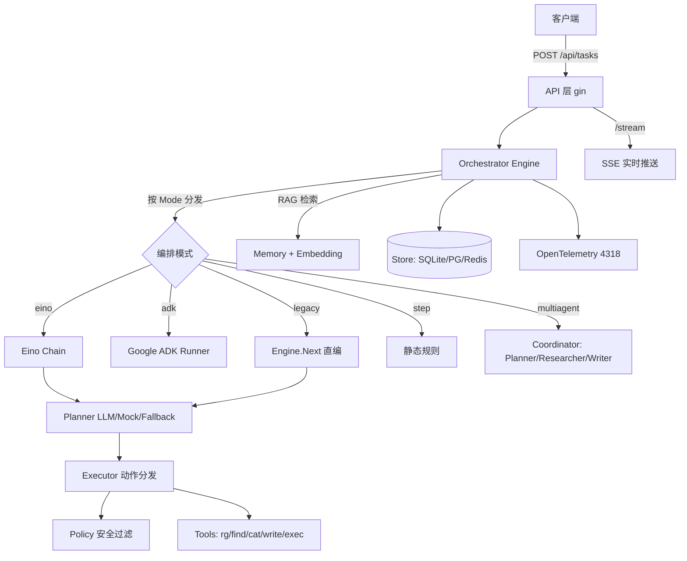

# AI Agent Runtime Engine — 项目分析与可扩展性报告

> 生成日期：2026-06-02 ｜ 项目：`github.com/wuxujun/ai-agent` ｜ 语言：Go 1.25 ｜ 代码量：约 9,075 行（内含测试）

---

## 一、项目定位

这是一个用 Go 构建的 **AI Agent 执行运行时引擎（Agent Runtime）**。它围绕用户给定的「目标（Goal）」，在受沙箱约束的「工作空间（Workspace）」内执行多轮 **Plan → Execute → Observe** 循环，直至目标达成。本质上是一个把 LLM 决策、工具调用、安全边界、持久化与可观测性整合在一起的服务端编排框架。

它的差异化在于三点：**多编排引擎可插拔**（同一套工具/存储/可观测性骨架，背后可切换 Eino / ADK / Legacy / Step / Multi-Agent 五种编排）、**统一可观测性与持久化**、以及 **RAG 跨任务长期记忆共享**。

---

## 二、整体架构

### 模块职责与规模

| 模块 | 行数 | 职责 |
|---|---|---|
| `internal/multiagent` | 1,858 | Coordinator 编排 Planner/Researcher/Writer 三个子 Agent 协作 |
| `internal/orchestrator` | 1,674 | 编排引擎主循环，承载 5 种 Mode、Eino/ADK Runner 缓存、RAG 注入 |
| `internal/store` | 1,630 | SQLite / Postgres / Redis / 内存 多后端持久化与长期记忆 |
| `internal/planner` | 1,110 | LLM / Mock / Fallback 规划器，JSON Schema 约束输出，Provider 抽象 |
| `internal/memory` | 841 | 记忆嵌入、RAG 检索、第三方检索接口、多源聚合去重 |
| `internal/api` | 435 | gin REST 路由、SSE 流、中间件 |
| `internal/tools` | 293 | rg / find / read / write / execute 等底层工具 |
| `internal/executor` | 241 | 把 Planner 决策的 Action 分发给具体工具 |
| `internal/policy` | 222 | 目录防穿透、软链接逃逸拦截 |
| `internal/metrics` / `telemetry` / `logger` | 329 | 本地指标、OTel 链路、结构化日志 |
| `internal/types` / `workspace` | 203 | 实体定义、沙箱与快照 |

### 核心数据流

任务实体 `types.Task` 贯穿全程，携带 `Goal / Status / MaxSteps / StepCount / Trace[] / Memories[] / ToolBudget / FinalAnswer` 等字段。每一步产出一个 `StepTrace`（含 `Action / Query / Observation / Evidence[] / AgentRole`），既写入 Store 也可经 SSE 推送。当 `StepCount==0` 时引擎自动做一次 RAG 检索：先查第三方检索 URL，再查本地向量库，聚合去重后注入到 Planner / Writer 的提示词上下文中。

### 当前支持的工具集（Action 枚举）

`find_files`、`search_text`、`read_file`、`write_file`、`execute_code`、`none`。Executor 用 `switch d.Action` 硬分发，每个分支在执行前调用 `policy.ValidateWorkspace` 做边界校验。

---

## 三、工程质量评估

**做得好的地方。** 抽象边界清晰——`Planner`、`Executor`、`Store` 都是接口，Mode 用枚举切换，便于替换实现。安全是认真对待的：`ValidateWorkspace` / `ValidateReadPath` 用 `filepath.EvalSymlinks` 把路径求值到真实物理路径，逐级解析父目录，能拦住软链接穿透。可观测性贯穿到 Span 级别，指标 + 链路 + 结构化日志三件套齐备。持久化层做了 UPSERT 增量写优化（联合唯一索引 `(task_id, step)`），避免了「全删全插」的写放大。测试覆盖了 planner / executor / store / orchestrator / memory / multiagent 各层。

**值得注意的张力。** 五种编排模式并存带来很高的灵活度，但也意味着同一份「Plan-Execute」语义在多处重复表达，维护成本随模式数量线性增长。`execute_code` 这个 Action 的存在让沙箱安全的重要性陡增——它是整个系统攻击面最大的一环。工具集目前是闭集（写死在 executor 的 switch 里），新增工具需要同时改 schema 枚举、executor 分支两处。

---

## 四、可扩展性分析

下面按「扩展维度 → 当前现状 → 扩展难度 → 建议路径」组织。我把它分成已经预留好扩展点的、和需要改造才能扩展的两类。

### A. 已具备良好扩展点的维度（低成本）

**1. 编排引擎（Orchestrator Mode）。** 这是项目最强的扩展点。`Mode` 枚举 + Engine 内分发已经支持五种编排，新增一种编排只需新增一个 Mode 常量和对应的 `runXxxNext` 方法，复用既有的 Store / Tools / Policy / OTel 骨架。适合接入新的 Agent 框架（如 LangGraph-Go 风格、或自研 DAG 编排）。

**2. LLM Provider。** `planner/provider.go` 已抽象出 `ProviderType`，通过 `AI_AGENT_LLM_PROVIDER` 环境变量切换。新增厂商（Anthropic / 通义 / DeepSeek / 本地 Ollama）只需实现 Provider 接口，对上层 Planner 透明。`FallbackPlanner` 的双路容错也已就绪，可天然用于「主用 A 厂、降级 B 厂」。

**3. 存储后端（Store）。** `Store` 接口已有 SQLite / Postgres / Redis / 内存 四套实现。新增后端（如 MySQL、TiDB、或向量专用库 Milvus/Qdrant）实现同一接口即可。**注意**：当前 `QueryMemories` 的向量检索在关系库里是「取出再算余弦」，规模上来后是瓶颈，这正是接专用向量库的动机。

**4. 记忆来源（RAG）。** 已支持第三方检索 URL（`AI_AGENT_RAG_SEARCH_URL`，GET/POST 可配，字段别名映射弹性解析）+ 本地库的 Merge/Fallback。再接入新的知识源（企业 Wiki、向量服务）成本很低。

### B. 需要改造才能顺畅扩展的维度（中高成本）

**5. 工具集（Tools / Action）。** 这是最值得优先改造的扩展点。当前新增工具要改三处：`schema.go` 的 enum、`executor.go` 的 switch、`tools/` 下的实现。建议引入 **工具注册表（Tool Registry）模式**：定义 `Tool` 接口（`Name() / JSONSchema() / Execute(ctx, params)`），各工具自注册，Executor 改为 `registry.Lookup(action).Execute(...)`，schema 从注册表动态生成。这样新增「HTTP 请求工具 / SQL 查询工具 / Git 操作工具 / 浏览器抓取工具」时只加一个文件，零散改动消失。

**6. 多 Agent 角色（Multi-Agent）。** 目前 Coordinator 编排的是固定的 Planner / Researcher / Writer 三角色（`AgentRole` 是写死的枚举）。若想支持「动态角色编队」（如增加 Critic / Reviewer / Coder），需要把角色抽象成接口、把协作拓扑从硬编码改为可配置（DAG 或 group-chat）。这是把它从「固定三人组」演进为「可编排 Agent 网络」的关键改造。

**7. 人类介入（Human-in-the-loop）。** 当前任务一旦 `run-all` 就自动跑到底，没有暂停/审批节点。要支持「危险动作（如 execute_code、write_file）前置人工确认」，需要在 Executor 前增加审批闸门 + 任务状态机扩展（如 `StatusAwaitingApproval`）+ API 增加 approve/reject 端点。SSE 已就绪，可复用做实时通知。

**8. 多租户与鉴权。** 当前 API 无鉴权、Task 无 owner 概念、Workspace 路径直接来自请求。要做成多用户 SaaS，需要在中间件加认证、Task 加租户隔离、Workspace 做按租户命名空间化。这是从「单机工具」走向「平台」的必经改造。

### C. 横向能力扩展（增量功能）

值得加的能力包括：**流式 LLM 输出**（目前 SSE 推的是 step 级，可下沉到 token 级）、**成本与限速治理**（统计 token 消耗、按任务/租户限额，现有 `ToolBudget` 可作为雏形扩展为 `TokenBudget`）、**任务编排的并行化**（Research Phase 已并发化，可推广到独立子目标并行）、**工具调用的重试与超时策略**（目前 `execute_code` 等缺乏统一的超时/重试中间件）。

---

## 五、优先级建议

如果要排一个演进顺序，我的建议是：

第一优先做 **工具注册表化（#5）**，因为它是其他一切能力扩展的地基——几乎每个新功能都意味着新工具，先把这条路修平，后续收益持续复利。第二优先做 **`execute_code` 的沙箱硬化与超时/审批闸门（#7 的一部分）**，因为它是当前最大的安全风险点，扩展工具集会进一步放大这个风险，需要同步加固。第三优先视目标而定：若往「更强的 Agent 协作」走，做多 Agent 动态编队（#6）；若往「对外提供服务」走，做多租户与鉴权（#8）。

向量检索瓶颈（#3 备注）属于「规模触发型」改造——数据量小时不必动，一旦长期记忆条目过万再接专用向量库。

---

## 六、一句话总结

这是一个抽象边界清晰、可观测性与安全意识到位的 Agent 运行时，**编排引擎 / LLM Provider / 存储后端 / RAG 来源**四个维度已经预留了优雅的插拔点，扩展成本很低；而 **工具集、Agent 角色编队、人类介入、多租户** 四个维度受限于当前的硬编码或缺失，是接下来投入改造能撬动最大杠杆的地方——其中工具注册表化最值得最先做。
