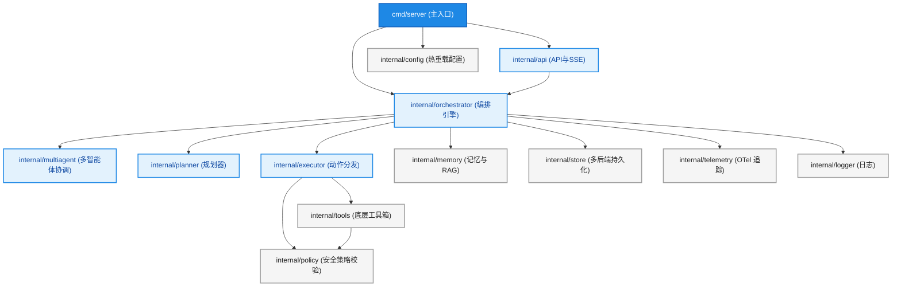
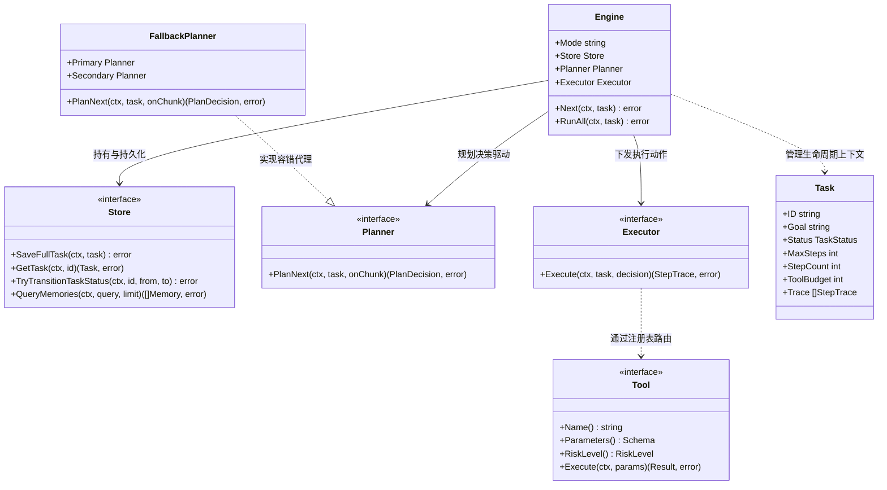
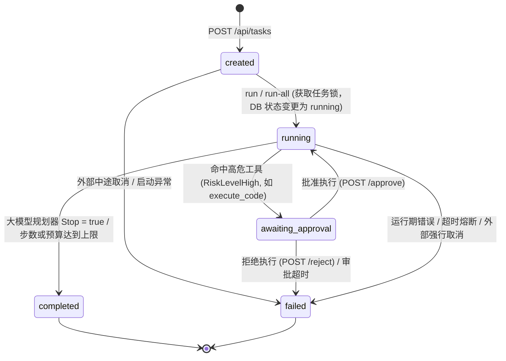
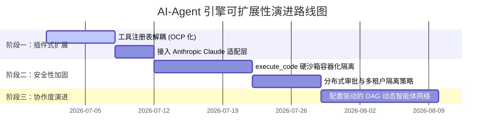

# AI Agent Go Runtime Engine — 项目分析与可扩展性报告

> **生成日期**：2026-06-26 ｜ **项目名**：`github.com/wuxujun/ai-agent` ｜ **语言版本**：Go 1.25 ｜ **规模**：约 15.6k 行 Go 代码（包含完整的单元测试与基准测试）

---

## 1. 项目定位与核心概念

本项目是一个基于 Go 语言构建的 **AI Agent 执行运行时引擎（Agent Runtime Engine）**。其核心机制是通过大语言模型（LLM）的推理能力与底层命令工具，围绕用户的 **“任务目标 (Goal)”** 在一个受到安全策略保护的 **“工作空间 (Workspace)”** 内，反复执行 **“规划 (Plan) ➔ 执行 (Execute) ➔ 观测 (Observe)”** 的循环，直到判定目标完成或运行资源（预算/步数）耗尽。

与常见的单体或简单 Agent 相比，该引擎的核心特色和差异化在于：
1. **多编排引擎入口可运行时插拔**：统一底层的持久化、安全边界和监控，支持 `eino` (默认)、`legacy`、`step`、`adk`、`multiagent` 5 种编排策略。
2. **三方锁步一致的 Schema 驱动**：工具注册表、大模型 JSON Schema 与动作参数验证完全基于工具描述动态生成，杜绝配置漂移。
3. **长期记忆与多源 RAG 共享**：跨任务自动召回与去重本地向量库及第三方检索服务中的历史经验。
4. **企业级运行特性**：完善的并发调度（有界 Worker 池）、高危工具人工审批悬挂、链路追踪（OpenTelemetry）与热重载。

---

## 2. 整体架构与结构图集

系统的设计遵循 **关注点分离（Separation of Concerns）** 与 **低耦合高内聚** 原则，以下从数据流、模块依赖、接口类图及生命周期四个维度展示系统结构。

### 2.1 整体数据流向图

```mermaid
graph TD
    Client[客户端 API 请求] -->|1. 创建/执行| API[API 层 internal/api]
    API -->|2. RAG 记忆预取| Memory[RAG & Memory]
    API -->|3. 驱动主循环| Engine[Orchestrator Engine]
    
    subgraph 编排层 (Orchestrator Mode Switch)
        Engine -->|eino| Eino[Eino Chain 编排]
        Engine -->|adk| ADK[Google ADK 编排]
        Engine -->|legacy| Legacy[Legacy 过程式编排]
        Engine -->|step| Step[Step 静态测试编排]
        Engine -->|multiagent| MA[Multi-Agent 协作编排]
    end

    subgraph 推理与安全执行环
        Eino & ADK & Legacy & Step & MA -->|4. 决策| Planner[Planner 规划器]
        Planner -->|LLM / Fallback / Mock| LLM[Gemini / OpenAI / Ollama]
        Eino & ADK & Legacy & Step & MA -->|5. 安全校验| Policy[Policy 安全策略]
        Policy -->|6. 分发| Executor[Executor 执行器]
        Executor -->|7. 运行| Tools[Tools 注册表与工具集]
    end

    Tools -->|8. 收集 Evidence 与 Observation| Engine
    Engine -->|9. 状态与 Trace 落库| Store[(Store: SQLite/PG/Redis/Memory)]
    Engine -->|10. 链路与指标上报| Telemetry[Telemetry & Metrics]
    API -->|11. 实时分发事件| SSE[SSE 事件流推送]
```

### 2.2 系统内部模块依赖图 (Module Dependency)

展示 `internal/` 下各私有包之间的调用和依赖拓扑关系（从上到下）：



### 2.3 核心类型与接口关系类图 (Class/Interface UML)

展示核心控制流程中的主要接口（`Store`, `Planner`, `Executor`, `Tool`）与实体结构（`Engine`, `Task`）的关联与实现关系：



### 2.4 任务生命周期状态机转移图 (Task State Machine)

展示任务 `Task` 从创建到终态的流转路径，以及高危工具调用时的人工审批（Awaiting Approval）挂起环：



### 2.5 模块结构与职责划分

| 包路径 | 核心职责 | 关键类型与入口 |
| :--- | :--- | :--- |
| [cmd/server](file:///Users/xujunwu/Documents/IDEAProject/ai-agent/cmd/server) | 依赖装配、配置加载与 Gin 服务启动 | `main.go` |
| [internal/api](file:///Users/xujunwu/Documents/IDEAProject/ai-agent/internal/api) | 提供 REST API、有界 Worker 池并发控制、SSE 事件流推送与审批控制器 | `Handler`、`RegisterRoutes` |
| [internal/orchestrator](file:///Users/xujunwu/Documents/IDEAProject/ai-agent/internal/orchestrator) | 任务主驱动引擎，负责预算检查、各编排模式分发、人工审批挂起 | `Engine`、`Next`、`RunAll` |
| [internal/multiagent](file:///Users/xujunwu/Documents/IDEAProject/ai-agent/internal/multiagent) | 编排 Planner / Researcher / Writer 多个 Agent 并发协作与 Replan 机制 | `Coordinator`、`runBatchParallel` |
| [internal/planner](file:///Users/xujunwu/Documents/IDEAProject/ai-agent/internal/planner) | LLM 规划决策（结构化 JSON Schema 输出）、Provider 插件与降级容错 Planner | `Planner`、`LLMProvider`、`FallbackPlanner` |
| [internal/executor](file:///Users/xujunwu/Documents/IDEAProject/ai-agent/internal/executor) | 解析规划动作并进行并发安全分发执行 | `DefaultExecutor.Execute` |
| [internal/tools](file:///Users/xujunwu/Documents/IDEAProject/ai-agent/internal/tools) | 工具注册表与 10 个内置命令（rg、find、read、write、exec 等） | `Registry`、`Tool`、`toolMiddleware` |
| [internal/skills](file:///Users/xujunwu/Documents/IDEAProject/ai-agent/internal/skills) | 项目动态 Skill 加载与规划器 `use_skill` 工具关联 | `Registry`、`RegisterUseSkill` |
| [internal/policy](file:///Users/xujunwu/Documents/IDEAProject/ai-agent/internal/policy) | 路径防越界逃逸、命令白名单与外部请求 URL 允许列表拦截 | `ValidateWorkspace`、`ValidateReadPath` |
| [internal/store](file:///Users/xujunwu/Documents/IDEAProject/ai-agent/internal/store) | sqlite (默认)/ postgres / redis / memory 四种存储后端持久化 | `Store`、`SaveFullTask` |
| [internal/memory](file:///Users/xujunwu/Documents/IDEAProject/ai-agent/internal/memory) | 向量生成与长期记忆的第三方端点/本地 SQLite RAG 召回与去重 | `GetEmbedding`、`DeduplicateMemories` |
| [internal/config](file:///Users/xujunwu/Documents/IDEAProject/ai-agent/internal/config) | 基于 Viper 的配置读取与动态热重载通知 | `Get`、`Reload`、`Watch` |
| [internal/telemetry](file:///Users/xujunwu/Documents/IDEAProject/ai-agent/internal/telemetry) | OpenTelemetry Trace 与 Metrics 的初始化与优雅停机 | `InitOTel` |
| [internal/metrics](file:///Users/xujunwu/Documents/IDEAProject/ai-agent/internal/metrics) | 本地内存指标与 Prometheus 性能指标的收集 | `Collector` |
| [internal/types](file:///Users/xujunwu/Documents/IDEAProject/ai-agent/internal/types) | 核心实体模型定义（Task、StepTrace、Evidence 等） | `Task`、`StepTrace`、`Evidence` |

---

## 3. 五种任务编排引擎分析

项目通过在 [engine.go](file:///Users/xujunwu/Documents/IDEAProject/ai-agent/internal/orchestrator/engine.go) 的 `Next` 方法中匹配环境变量 `AI_AGENT_ORCHESTRATOR_MODE` 分发到五种不同的编排模式：

### 3.1 编排模式对比

| 模式 | 实现文件 | 核心机制 | 优势 | 适用场景 |
| :--- | :--- | :--- | :--- | :--- |
| **eino** *(默认)* | [eino.go](file:///Users/xujunwu/Documents/IDEAProject/ai-agent/internal/orchestrator/eino.go) | 字节 Eino `compose.Chain` 并发缓存链路 | 强可复用性，节点流转结构化，流式友好 | 生产环境默认业务流 |
| **legacy** | [engine.go](file:///Users/xujunwu/Documents/IDEAProject/ai-agent/internal/orchestrator/engine.go) | 过程式直接调度循环 | 执行路径最短，无第三方框架额外心智，易调试 | Eino 链路调试与回退 |
| **step** | [step.go](file:///Users/xujunwu/Documents/IDEAProject/ai-agent/internal/orchestrator/step.go) | 硬编码三步静态动作机 | 无需 LLM 决策，秒级响应，结果高度确定 | 本地集成测试与无 LLM 环境演示 |
| **adk** | [adk.go](file:///Users/xujunwu/Documents/IDEAProject/ai-agent/internal/orchestrator/adk.go) | Google ADK-for-Go 官方套件与 Runner | 拥抱 Google 官方 ReAct 生态，自动化工具调用 | 复杂的多步多参数自主推理 |
| **multiagent** | [multiagent.go](file:///Users/xujunwu/Documents/IDEAProject/ai-agent/internal/orchestrator/multiagent.go) | Coordinator 编排三 Agent 网络 | 研究任务并发化（Research 批次打包并发），支持自动 Replan 与 Write Confidence 深度反馈 | 超长链路、高复杂度多步骤分析任务 |

### 3.2 Multi-Agent 协作设计细节
[internal/multiagent](file:///Users/xujunwu/Documents/IDEAProject/ai-agent/internal/multiagent) 是项目中较为复杂的模块，设计了 **Planner ➔ Researcher (xN 并发/串行) ➔ Writer** 协作机制。其精妙之处在于：
- **安全感知分类**：在批次打包时，`isReadOnlyAction` 根据工具的 `RiskLevel()` 自动剔除写操作或高危操作（如 `execute_code`），因为只有串行执行路径才会触发人工审批 `SuspendForApproval`，防止并发导致审批绕过漏洞。
- **反馈与自愈环**：Writer 产出结果时，若自信度（Confidence）低且仍有资源，会自动重算拓扑并启动 Replan（上限 3 次）；若任务无法完成，将状态显式更改为 `failed`，避免把故障掩盖为 `completed`。

---

## 4. 关键设计约束与三大不变量

为了保证大模型在多轮运行中始终输出符合系统预期的 JSON，且不因新工具的增删导致 Schema 解析 and 校验混乱，项目确立了三个重要的底层设计约束：

### 4.1 工具三方锁步一致不变量 (3-Way Invariant)
在新增或修改工具时，以下三个节点必须锁步一致：
1. **工具描述**：[tools.DefaultRegistry](file:///Users/xujunwu/Documents/IDEAProject/ai-agent/internal/tools) 中登记的工具列表及它们的 `Parameters()` Schema。
2. **大模型 Schema 注册**：[schema.go](file:///Users/xujunwu/Documents/IDEAProject/ai-agent/internal/planner/schema.go) 中生成的 `PlannerDecisionSchema` 与 `PlannerDecisionGenAISchema`（面向 Gemini 客户端）。
3. **动作决策校验**：[validate.go](file:///Users/xujunwu/Documents/IDEAProject/ai-agent/internal/planner/validate.go) 中的 `ValidateDecision` 解析判定。

> [!IMPORTANT]
> **设计价值**：Schema 是从工具注册表中**动态反射生成**的，开发人员绝不需要手写 JSON Schema。这极大地降低了工具定义变更后，模型生成参数与代码解析定义发生“漂移（drift）”的风险。

### 4.2 Skill 注册与接线顺序
动态技能系统在启动时由 [skills.Registry](file:///Users/xujunwu/Documents/IDEAProject/ai-agent/internal/skills) 统一载入，并且必须通过 `RegisterUseSkill` 将 `use_skill` 作为一个工具注入到 Tools 注册表中。
> [!WARNING]
> **时序依赖**：必须在 `Planner` 编译 Schema 并缓存之前完成 `RegisterUseSkill`。在 [main.go](file:///Users/xujunwu/Documents/IDEAProject/ai-agent/cmd/server/main.go) 中有显式的注释与依赖控制逻辑，必须严格遵守。

### 4.3 配置防高速缓存（Viper Watcher 约定）
系统的配置对象采用热重载机制（支持 `POST /api/config/reload` 零停机重载）。
- **编码守则**：使用配置时必须直接调用 `config.Get()` 实时获取当前生效的属性，**严禁使用包变量或局部变量长期缓存配置指针**，否则会导致动态密钥轮换、超时参数调优等实时变更失效。

---

## 5. 工程质量与优化建议

在最近一轮代码修正与测试跑通后，目前项目的整体工程质量有了明显提升，但依然存在一些多实例水平扩展和并发时序上的细节可以进一步改善：

### 1) 缓存 Eino Chain 编译结果以减轻内存压力
- **现状**：[eino.go](file:///Users/xujunwu/Documents/IDEAProject/ai-agent/internal/orchestrator/eino.go) 每次接收到 `Next` 触发时，都会重新编译 Einocompose Chain。虽然使用了 `sync.RWMutex` 进行二次检查（Double-check），但是在超高并发任务处理场景下仍然存在多核锁竞争和 GC 开销。
- **改进建议**：在 `Engine` 初始化阶段完成编译，将 Chain 编译出的可运行实例 `compose.Runnable` 直接注入引擎。

### 2) 审批状态（Approval State）的多实例水平扩展限制
- **现状**：审批信号信道挂载在 [approval.go](file:///Users/xujunwu/Documents/IDEAProject/ai-agent/internal/orchestrator) 的进程内全局 `sync.Map` 结构中。当引擎需要人工介入而转入 `SuspendForApproval` 状态时，如果系统的 API 层由多实例负载均衡部署，释放审批的请求被分发到了未持有该 Task channel 句柄的实例，将导致审批操作彻底超时。
- **改进建议**：如果目标是分布式高可用架构，应将审批的挂载/激活机制通过外部队列或中间件（例如 Redis Pub/Sub）做分布式发布订阅广播，而不是锁定单机内存。

### 3) 并行执行批次的 Token 预算检测时序存在泄露风险
- **现状**：在 Multi-Agent 并发研究阶段 `runBatchParallel` 会一次性扣除任务的 Step 和 Tool 资源配额。但大模型的 `TokenBudget` （Token 预算防溢出限制）仅在每一个 Batch **开始前**执行单次判定，意味着若并发批次十分庞大，单轮内大模型吐出的大量 Token 可能会一次性突破预设配额而无法在中途被熔断。
- **改进建议**：在并发批次内部建立更细粒度的流式 Token 累加与原子判定熔断控制。

### 4) `cancelTask` 的分布式撤回逻辑优化
- **现状**：当执行任务取消请求 `DELETE /api/tasks/:id/cancel` 时，如果任务不在本实例内存的 `activeTasks` 中，系统会通过单机 store 将 DB 状态直接强改为 `failed`。但此动作并不能跨网络取消正在另一个物理节点上正常运转的 goroutine。
- **改进建议**：引入心跳检查或通过消息总线多路分发任务取消事件（Task Cancel Context Cancellation Broadcast）。

---

## 6. 可扩展性深度分析与扩展指南

可扩展性是衡量 Agent Runtime 是否健壮的最重要指标。下面将项目分为 **“已预留扩展接口的维度 (低成本自适应)”** 与 **“需要小幅改造的维度 (高收益中成本)”** 两个层面进行梳理。

### 6.1 架构层面的低成本扩展点

```
┌────────────────────────────────────────────────────────────────────────┐
│                              可插拔扩展点                               │
└──────┬───────────────────┬───────────────────┬───────────────────┬─────┘
       ▼                   ▼                   ▼                   ▼
 编排模式 (Engine)     模型厂商 (LLM)      持久化层 (Store)    长期记忆 (RAG)
 ───────────────     ─────────────     ───────────────     ─────────────
 只需要在 Engine     实现 LLMClient    实现 Store 接口     支持配置 RAG
 增加分支, 复用      并在 provider     即可无缝切换到      第三方端点或
 原有存储与安全      注册, 自动探测     PG/Redis/MySQL      挂载本地向量
```

#### A. 编排引擎 (Orchestration Engine Mode)
- **代码位置**：[internal/orchestrator/engine.go](file:///Users/xujunwu/Documents/IDEAProject/ai-agent/internal/orchestrator/engine.go) 的 `Engine.Next` 分发。
- **扩展方式**：新增一种模式只需在 `Engine.Mode` 注册新常量，并在 `Engine.Next` 内补齐 `runXxxNext(ctx, task)` 分支，原有存储、监控、审批机制一应复用。适用于接入 LangGraph-Go 或其它流式有向无环图 Agent 框架。

#### B. 大模型提供商 (LLM Provider)
- **代码位置**：[internal/planner/llm.go](file:///Users/xujunwu/Documents/IDEAProject/ai-agent/internal/planner/llm.go) & [provider.go](file:///Users/xujunwu/Documents/IDEAProject/ai-agent/internal/planner/provider.go)。
- **扩展方式**：项目已经定义了 `LLMProvider` 抽象接口，包含 `PlanNext` 的主要行为。扩展新厂商（例如 Anthropic Claude、DeepSeek..）只需完成适配层，大模型 Schema 与主链路无需任何变更，同时能直接接入 `FallbackPlanner` 享受主/备厂商无缝降级。

#### C. 数据存储后端 (Store)
- **代码位置**：[internal/store/store.go](file:///Users/xujunwu/Documents/IDEAProject/ai-agent/internal/store/store.go) 的 `Store` 接口定义。
- **扩展方式**：系统目前提供 `sqlite`、`postgres`、`redis`、`memory` 四种现成后端。要想迁往高吞吐的 DynamoDB 或分布式 MySQL，只需实现接口方法即可。

---

### 6.2 改造层面的中高收益扩展点

#### D. 工具集由闭集向“工具注册表模式（Dynamic Tool Registry）”演进
- **改造点**：目前新增一个底层工具除了要在 `internal/tools` 下写逻辑，还需要在 `schema.go` 的枚举、`executor.go` 的 `switch` 控制流中补齐对应的动作映射，开发链路较长。
- **演进思路**：
  将 `Executor` 从现在的硬分发（Hard switch）演进为基于接口的动态分发：
  ```go
  type ExecutableTool interface {
      Name() string
      Parameters() json.RawMessage // 描述其 JSON Schema
      RiskLevel() RiskLevel
      Execute(ctx context.Context, params map[string]interface{}) (Result, error)
  }
  ```
  在 [executor.go](file:///Users/xujunwu/Documents/IDEAProject/ai-agent/internal/executor/executor.go) 中只需要查表调用：
  ```go
  toolInstance, err := tools.DefaultRegistry.Lookup(actionName)
  // ...
  result, err := toolInstance.Execute(ctx, params)
  ```
  这样可做到彻底的 **Open-Closed Principle (开闭原则)**。新增诸如 “SQL查询”、“Git推送”、“浏览器自动化” 工具时，只需像写插件一样，在 `tools/` 目录下新增一个独立 Go 文件并调用 `init() { Register(...) }` 即可，主干框架代码一字不改。

#### E. 动态 Multi-Agent 编队设计
- **改造点**：现有的 `multiagent` 协作网络包含三个硬编码的执行节点（Planner, Researcher, Writer），角色与状态流转是固定的。
- **演进思路**：
  若想支持更为复杂的 Agent 团队协作（例如加入批判家 Critic、代码编写者 Coder 等角色进行自主迭代）：
  - 将 Agent 角色抽象成可声明的接口。
  - 将协调器 [coordinator.go](file:///Users/xujunwu/Documents/IDEAProject/ai-agent/internal/multiagent/coordinator.go) 改为解析 DAG 配置或群聊控制策略（Group Chat Manager），使得协作网络具备动态编排能力。

#### F. 更加健全的 Workspace 路径防沙箱逃逸设计
- **改造点**：[policy.go](file:///Users/xujunwu/Documents/IDEAProject/ai-agent/internal/policy/policy.go) 中的 `ValidateWorkspace` 虽然能拦截基本的 `..` 与特殊符号链接。但面对极其狡猾的动态硬链接（Hard links）、跨卷挂载或运行期才被软链指向的动态路径，在极端情况下仍有防御遗漏漏洞。
- **演进思路**：
  - 在真正读取、写入、甚至调用 `exec_code` 执行 Shell 指令时，将工作空间绝对根与评估求值后的最终物理文件绝对路径进行最严格的前缀和深度对比；
  - 终极方案是利用容器化隔离技术（如 Docker SDK、gVisor 或 Docker-in-Docker），对 `execute_code` 动作进行硬件层面的硬沙箱隔离，防范宿主机遭到穿透。

---

## 7. 下一步演进优先级与路线图建议 (Roadmap)

为了进一步提升本 AI Agent 引擎的扩展上限与运行安全性，建议的扩展优先级如下：



### 🎯 演进细节拆解：
1. **阶段一：实现“工具注册表彻底解耦（Dynamic Tool Registry）”**
   - 目的：大幅降低开发者的扩展门槛。
   - 成果：只需一个 Go 文件的自注册机制，即可为引擎无缝添置新的 AI 工具，一键生成最新的大模型交互 Schema。
2. **阶段二：高危代码运行环境容器化**
   - 目的：消弭目前最危险的 `execute_code` 安全攻击面。
   - 成果：AI 规划出的编译与运行命令全部在轻量级 Docker 沙箱内执行，宿主机不受任何潜在非法越界脚本的危害。
3. **阶段三：支持配置驱动的动态智能体网络（DAG Multi-Agent Group Chat）**
   - 目的：让引擎能解决工业级的极其长尾、极其复杂的系统级多步逻辑分析任务。
   - 成果：将写死的 Planner-Researcher-Writer 三人组转换为能根据 `teams.yaml` 或配置文件自由组合的智能体作战群（如 "程序员 Agent" + "白盒审计 Agent" + "运维上线 Agent"）。

---

*报告结束。本报告所涉及的文件关系已在 [github.com/wuxujun/ai-agent](file:///Users/xujunwu/Documents/IDEAProject/ai-agent) 代码仓库的最新构建状态下完成对齐，全部单元测试均正常通过。*
